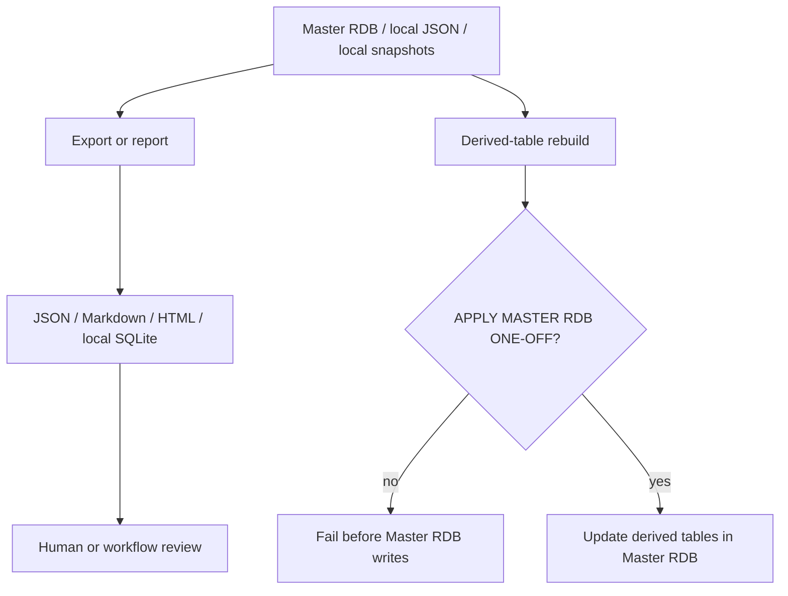

# Build / Export / Report Operations

作成日: 2026-06-26 JST
署名: おと（Codex）

## Purpose

`build_*`, `export_*`, `compare_*`, and `audit_*` scripts mix several kinds of
work:

- deterministic local artifact generation,
- read-only reports,
- public export generation,
- Master RDB derived-table rebuilds.

This document fixes which ones can stay automatic and which ones need explicit
manual confirmation.

## Automatic / Safe Generated Outputs

These can remain in scheduled or local generation flows:

| Group | Examples | Writes |
| --- | --- | --- |
| Public export | `export_public_events.py`, `export_public_venues.py`, `export_public_glossary.py` | repo-local public JSON/JS |
| Public export postprocessors | `export_public_events.py` calls `apply_public_date_predictions.py`, `apply_public_historical_references.py`, `apply_public_season_hints.py` in-process | repo-local public JSON/JS |
| Audit/report | `audit_master_rdb.py`, `compare_notion_snapshot_to_master.py`, `export_rdb_review_report.py`, `run_post_batch_maintenance.py` | report JSON/Markdown |
| Review queue builders | `build_weekly_harvest_candidates.py`, `build_keyboard_review_ui.py`, `build_youtube_*_queue.py`, `export_youtube_*_plan.py` | review JSON/Markdown/HTML |
| Local RDB snapshots | `build_notion_rdb.py`, `build_evidence_rdb.py`, `build_youtube_rdb.py`, `build_bon_odori_rdb.py`, `build_all_rdb.py` | local SQLite snapshots and reports |

These do not directly mutate Notion, S3, CloudFront, or Google Calendar.
Public deployment remains controlled by site sync/deploy workflows.

## Manual Confirmation Required

These are build scripts, but they write into Master RDB derived tables:

| Script | Writes | Confirmation |
| --- | --- | --- |
| `build_historical_promotion_candidates.py` | `historical_promotion_candidates`, `predicted_occurrence_dates`, manifest post-build metadata | `APPLY MASTER RDB ONE-OFF` |
| `build_registered_event_investigation_queue.py` | `event_investigation_tasks`, manifest post-build metadata | `APPLY MASTER RDB ONE-OFF` |

They do not confirm public event dates and do not write Notion, but they still
mutate the Master RDB file. Keep them manual unless they are wrapped in a
dedicated rebuild workflow with explicit policy and tests.

## Flow

## Automation Boundary

Do not add schedules around derived-table rebuilds without first updating this
runbook and `docs/manual-auto-operations-inventory.md`.

If a derived rebuild becomes part of the normal Master RDB regeneration path,
prefer a single explicit rebuild workflow that:

- fetches the current Master RDB artifact,
- writes a dry-run or copied DB first,
- runs `audit_master_rdb.py`,
- publishes only after high-severity issues are absent,
- records the change in the manual/auto inventory.
