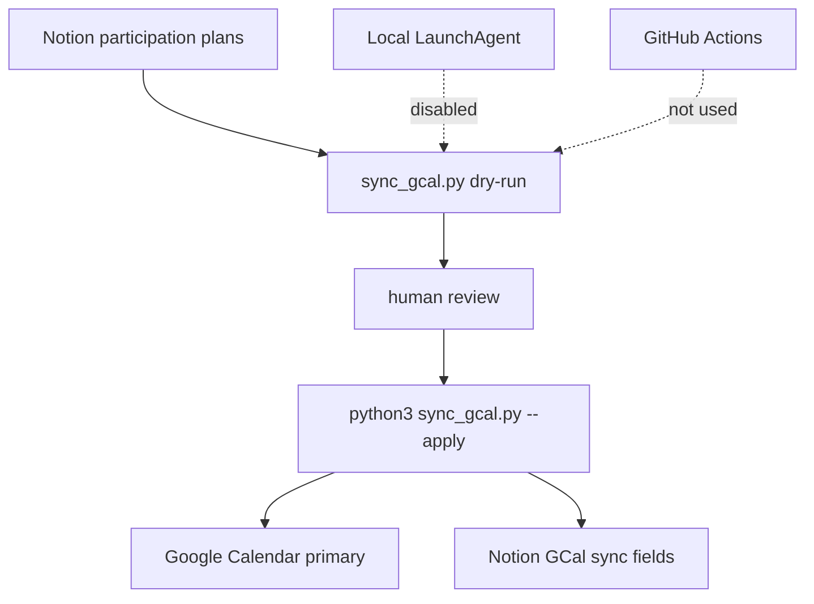

# Google Calendar Sync Operations

Updated: 2026-06-26 JST  
署名: おと（Codex）

## Position

Google Calendar sync is a personal convenience flow, not a public-data or
Master RDB synchronization path.

Keep it manual-only.

Allowed:

- Read Notion `参加計画` as Uchida-san's personal planning input.
- Dry-run the Google Calendar sync to see what would be created, updated, or deleted.
- Apply the sync manually after checking the dry-run result.

Not allowed by default:

- LaunchAgent daily execution.
- GitHub Actions scheduled execution.
- Background writes to Google Calendar.
- Background writes to Notion `GCal同期ID` / `日付`.

## Flow



## Current Local State

The installed LaunchAgent has been moved out of active launchd discovery:

```text
~/Library/LaunchAgents/com.koto.bon-odori-calendar-sync.plist.disabled
```

The old shell wrapper remains as historical/manual material:

```text
~/Library/Scripts/koto/calendar-sync.sh
```

If the wrapper is run without arguments, `sync_gcal.py` now performs a dry-run
and does not write to Google Calendar or Notion.

## Manual Runbook

Install dependencies if needed:

```bash
pip install -r requirements-gcal.txt
```

Check what would change:

```bash
python3 sync_gcal.py
```

Apply only after reviewing the dry-run output:

```bash
python3 sync_gcal.py --apply
```

Expected dry-run counters:

- `would_create`: Notion plan has no `GCal同期ID`; a calendar event would be inserted.
- `would_update`: Notion plan has `GCal同期ID`; the calendar event would be updated.
- `would_delete`: plan is no longer `参加予定` / `検討中`, event is unconfirmed, or date is missing.
- `skipped`: no calendar action is needed or the plan is not syncable.

Expected apply counters:

- `created`, `updated`, `deleted` show actual writes.
- `would_*` should stay zero during apply.

## Why Manual

This flow writes to a personal calendar and writes sync metadata back to Notion.
It also depends on local OAuth credentials (`credentials.json` / `token.json`).

That makes it a poor fit for unattended automation:

- it is local-user state, not shared project state,
- it is not part of the public site or Master RDB pipeline,
- accidental deletions are more annoying than a missed daily update,
- Notion is no longer the public event source of truth.

## Re-enabling Rule

Do not re-enable the LaunchAgent unless all of these are true:

- Uchida-san explicitly wants automatic personal calendar sync again.
- `sync_gcal.py --apply` has been run manually and the result is understood.
- The LaunchAgent command includes an explicit `--apply`.
- The manual/auto inventory is updated before enabling launchd.
