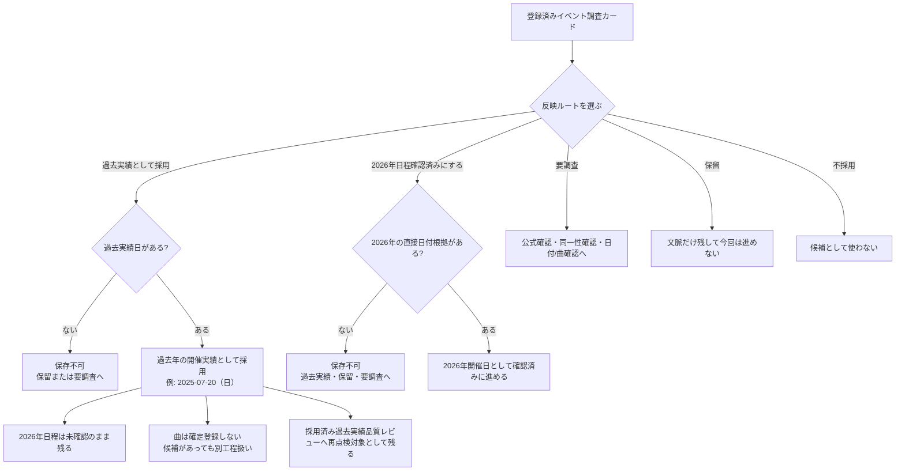
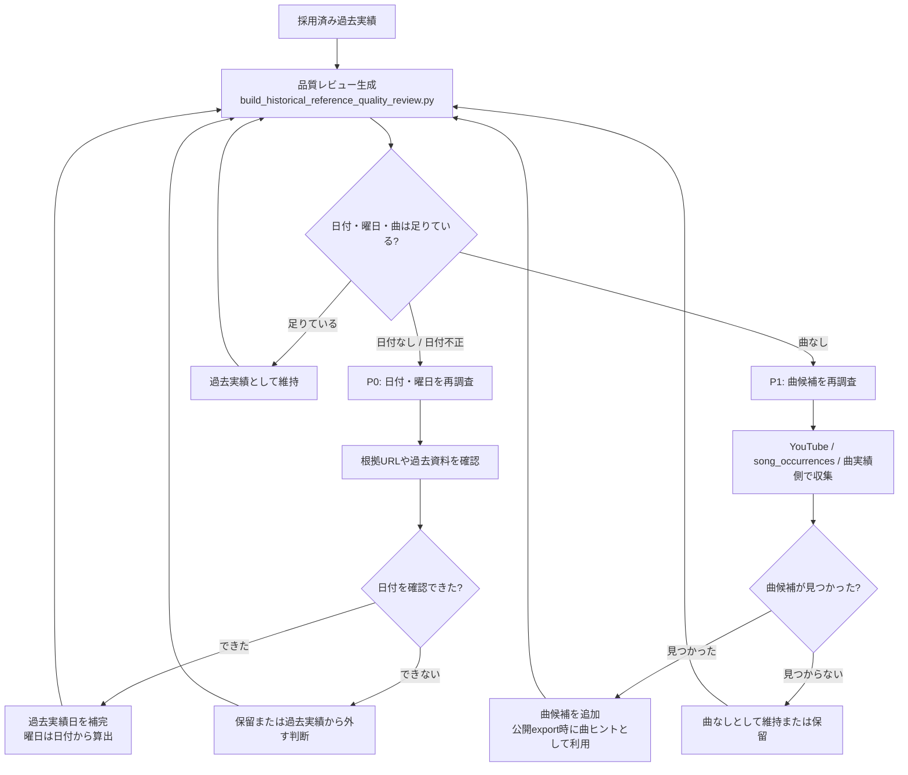

# 過去実績採用と再点検フロー

Updated: 2026-06-26 JST  
署名: おと（Codex）

## 目的

この図は、レビューコンソールで `過去実績として採用` を押した後に、日付・曜日・曲の確認機会がどこへ残るかを示す。

重要な前提:

- `過去実績として採用` は、2026年開催確定ではない。
- 2026年の日程確認済みにするには、2026年の直接根拠が必要。
- 過去実績採用だけでは、曲データは確定登録されない。
- 採用済み過去実績は、後続の品質レビューで再点検される。

## 登録済みイベント調査からの流れ

## 採用後の再点検サイクル

## 今のデータでの状態

2026-06-26 時点のローカル生成結果:

- 過去実績系: 93件
- 日付なし: 0件
- 曲なし: 65件

そのため、現在の `採用済み過去実績品質レビュー` は主に `曲候補を再調査` のためのキューになっている。

## 判断の目安

`過去実績として採用` してよい:

- 過去実績日がある。
- 曜日は日付から算出できる。
- 2026年確定ではないことを理解したうえで、過去年の根拠として残す価値がある。

`保留` または `要調査` にする:

- 過去実績日がない。
- 日付があっても同一イベント性が怪しい。
- 根拠URLが弱い。
- 曲候補を別工程で必ず追いたいというメモを残したい。

`曲候補を再調査` にする:

- 採用済み過去実績として日付・曜日は残っている。
- ただし曲データがない。
- YouTube / song_occurrences / 曲実績側で追加収集したい。

