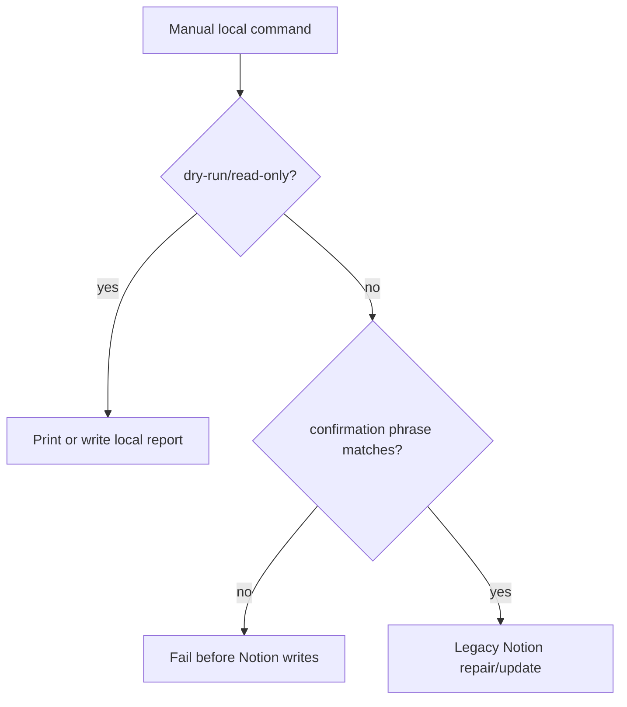

# Legacy Notion Repair / Registration Operations

作成日: 2026-06-26 JST
署名: おと（Codex）

## Purpose

Old `fill_*`, `register_*`, `merge_*`, `fix_*`, glossary, song-master, and X
member repair scripts can still change Notion directly.

They are useful as audited recovery tools, but they must not become scheduled
or casual local commands.

## Decision

Keep them manual.

Any path that changes Notion requires:

`APPLY LEGACY NOTION REPAIR`

This is intentionally separate from the YouTube evidence confirmation phrase.
These scripts are broader one-off repair tools for venue, event, glossary, song,
and X member state.

## Script Groups

| Group | Scripts | Guard |
| --- | --- | --- |
| Venue/event one-off repairs | `fill_missing_venue_addresses.py`, `fill_venue_access_and_scale.py`, `fix_aoyama_kumano_event_venue.py`, `merge_duplicate_venues.py`, `fix_venue_master_cleanup.py` | confirmation required before any Notion write |
| Venue/event registrations | `register_blog_venue_candidates.py`, `register_fallback_event_candidates.py`, `fill_public_intros.py` | confirmation required for write mode; `fill_public_intros.py` keeps dry-run default |
| Glossary/song setup and migration | `create_glossary_v2_db.py`, `update_glossary_v2_schema.py`, `register_glossary_v2_seed_candidates.py`, `register_reviewed_glossary_v2_terms.py`, `promote_reviewed_glossary_v2_batch.py`, `migrate_legacy_glossary_aliases_to_v2.py`, `create_song_master_db.py`, `register_song_master_initial.py`, `clear_registered_glossary_v2_roles.py` | dry-run remains available where it already existed; write mode requires confirmation |
| Song master review and cleanup applies | `apply_retrospective_song_candidates.py`, `apply_weekly_harvest_human13_decisions.py`, `apply_weekly_song_review_decisions.py`, `apply_weekly_song_final_corrections.py`, `clean_song_master_titles.py` | dry-run remains available; real song/glossary page updates require confirmation |
| X member / score one-offs | `replace_x_members.py`, `sync_x_account_scores.py` | confirmation required before Notion member-list writes |
| Review-result apply scripts | `apply_accepted_venue_song_associations.py`, `apply_missing_venue_review_decisions.py` | `--apply` requires confirmation |

Read-only exporters such as `sync_venue_master.py` are not part of this guard.
They read Notion and write local JSON.

## Flow



## Apply Command Shape

Use the narrowest script and keep the confirmation phrase visible in shell
history.

```bash
python3 fill_missing_venue_addresses.py \
  --confirm "APPLY LEGACY NOTION REPAIR"
```

For scripts that already expose `--apply`:

```bash
python3 apply_missing_venue_review_decisions.py \
  --apply \
  --confirm "APPLY LEGACY NOTION REPAIR"
```

## Automation Boundary

Do not schedule these scripts.

If a repair needs to happen repeatedly, promote the logic into a reviewed
Master RDB or review-console workflow instead of reusing these one-off Notion
write paths.
