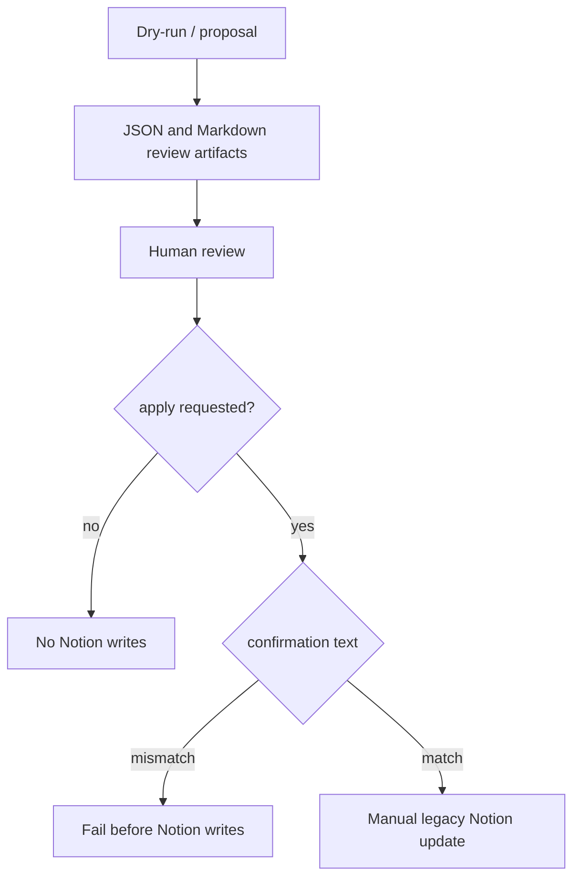

# Legacy Notion Write-Back Operations

作成日: 2026-06-26 JST
署名: おと（Codex）

## Purpose

Master RDB is the source of truth for public event data.

Legacy scripts that can write from local review material back to Notion must
stay manual. Dry-run and report generation are allowed, but actual Notion
updates require explicit confirmation.

## Current Decision

Do not automate Master RDB -> Notion write-back.

`legacy/notion_writes/sync_master_to_notion.py` is frozen by default:

- dry-run writes JSON/Markdown review material only;
- `--apply` is blocked unless `--allow-frozen-notion-write` is also present;
- `--apply` requires `--confirm "APPLY RDB TO NOTION"`;
- dry-run jobs and validation issues are refused.

Additional legacy Notion apply scripts now require confirmation too:

2026-07-21 のcloseout整理で、この節の5本はすべて
`legacy/notion_writes/` へ移動した。repo rootから
`python3 -m legacy.notion_writes.<module>` として手動実行する。

| Script | Writes | Confirmation |
| --- | --- | --- |
| `legacy/notion_writes/sync_fixed_date_rules_to_notion.py` | fixed-date columns/details on Notion event pages | `APPLY FIXED DATE RULES TO NOTION` |
| `legacy/notion_writes/promote_event_dates.py` | event date/status/detail fields on Notion event pages | `APPLY EVENT DATES TO NOTION` |
| `legacy/notion_writes/classify_x_members.py` | X member account type/tags | `APPLY X MEMBER CLASSIFICATION TO NOTION` |
| `legacy/notion_writes/sync_x_display_names.py` | X member display names | `APPLY X DISPLAY NAMES TO NOTION` |

## Flow

## Automation Boundary

Do not add scheduled workflows around these scripts.

If Notion write-back is needed, run the smallest specific script manually after
reviewing its generated artifact. Prefer updating Master RDB and public exports
instead of Notion unless the Notion surface is explicitly the target.

## Related Policy

Older YouTube/retrospective direct Notion apply scripts are covered separately
in `docs/legacy-youtube-notion-apply-operations.md`.

One-off Notion repair and registration scripts are covered separately in
`docs/legacy-notion-repair-operations.md`.

## Next Review Candidate

The next manual/auto boundary is Master RDB / public JSON one-off apply scripts.
These are scripts that mutate local source data or public exports without going
through the normal review-console and export flow.
