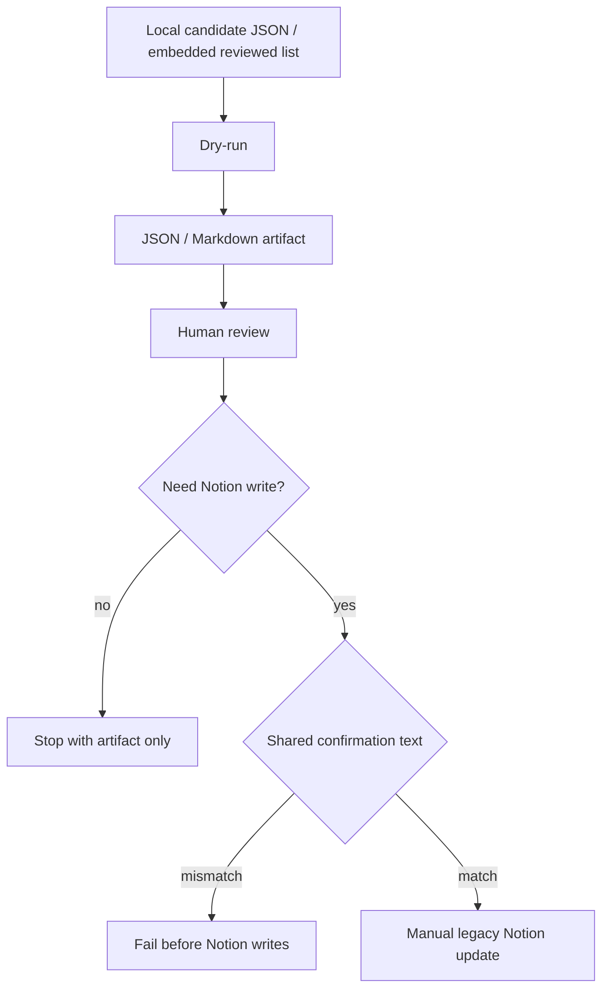

# Legacy YouTube / Retrospective Notion Apply Operations

作成日: 2026-06-26 JST
署名: おと（Codex）

## Purpose

YouTube証拠やretrospective候補をNotionへ直接反映する古い
`apply_*` スクリプト群の扱いを固定する。

これらはMaster RDB primary運用の前に作った局所反映ツールなので、
通常の自動処理には組み込まない。

## Current Decision

Do not automate these direct Notion apply scripts.

Dry-run/report generation may be used for inspection. Actual Notion writes
require all of the following:

- the operator has reviewed the generated JSON/Markdown artifact;
- the command is run manually;
- `--apply` is present;
- `--confirm "APPLY LEGACY YOUTUBE NOTION UPDATES"` is present.

## Covered Scripts

All scripts below use the shared confirmation phrase:
`APPLY LEGACY YOUTUBE NOTION UPDATES`.

| Script | Main use | Default |
| --- | --- | --- |
| `apply_youtube_existing_event_updates.py` | YouTube evidence notes onto existing events | dry-run |
| `apply_youtube_active_existing_event_updates.py` | active YouTube evidence onto existing events | dry-run |
| `apply_youtube_2025_official_candidate_existing_updates.py` | 2025 official-candidate evidence onto existing events | dry-run |
| `apply_youtube_review_video_evidence.py` | reviewed video evidence updates | dry-run |
| `apply_youtube_official_confirmation.py` | official-confirmed YouTube updates | dry-run |
| `apply_youtube_2025_date_backfill.py` | 2025 date backfill from YouTube/official evidence | dry-run |
| `apply_youtube_2025_curated_official_candidates.py` | curated official candidates, including event/venue creation | dry-run |
| `apply_youtube_2025_koto_ready_events.py` | Koto-reviewed 2025 event candidates | dry-run |
| `apply_retrospective_ready_venue_events.py` | retrospective venue/event creation | dry-run |
| `apply_retrospective_existing_event_updates.py` | retrospective evidence notes onto existing events | dry-run |
| `apply_youtube_blocked_new_events.py` | blocked new-event candidates after non-YouTube confirmation | dry-run |
| `apply_youtube_reviewed_new_events.py` | reviewed new-event creation after official confirmation | dry-run |

## Flow

## Automation Boundary

Do not add cron, LaunchAgent, or scheduled GitHub Actions around these scripts.

If the same data should affect the public site, prefer the current route:
Master RDB update, public export, site sync, and normal deploy policy.

Use these scripts only when the Notion surface itself is explicitly the target
or when inspecting legacy migration material.

## Related Policy

Other one-off Notion repair and registration scripts are covered in
`docs/legacy-notion-repair-operations.md`.

## Next Review Candidate

The next manual/auto boundary is Master RDB / public JSON one-off apply scripts.
These are scripts that mutate local source data or public exports without going
through the normal review-console and export flow.
