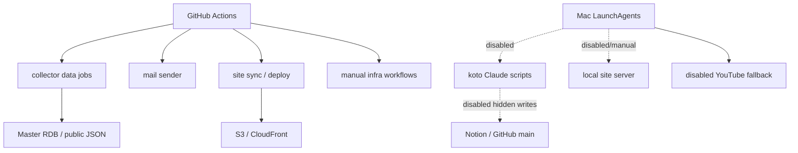

# Manual / Auto Operations Inventory

作成日: 2026-06-26 JST
署名: おと（Codex）

## Purpose

盆踊りプロジェクトで「自動で動かすもの」と「手動で明示実行するもの」
を混ぜないための台帳。

判断基準は次の通り。

- 外部API quotaを使うものは、実行元を1つにする。
- `git commit` / `git push` するものは、GitHub Actions側に寄せる。
- Notionへ書くものは、正本境界が明確なものだけ自動化する。
- S3 / CloudFront / DNS / WAF / SES など公開インフラを変えるものは、手動または明示入力付きにする。
- ローカルMacのLaunchAgentは、GitHub Actionsから見えないため、重複実行と作業ツリー依存に注意する。

## Overall Shape

## Recommended Classification

| 区分 | 対象 | 推奨 |
| --- | --- | --- |
| 自動継続（Notion書き込みは手動） | `collect.yml` | 継続。ただしMaster RDB監査と公開guardを前提にする。RSS/X収集とDynamoDB候補生成は自動、legacy Notion変更は `allow_notion_writes=true` の手動実行時だけ。 |
| 自動化候補 | X news digest for Oto / rare_signal builder | まず既取得X由来ニュースを既存DBと照合して `x_news_digest_for_oto` を作り、おとが読んだ後に新規情報または差分だけを `rare_signal` レビュー候補へ昇格する。固定キーワード検知を主役にしない。X API探索拡大やNotion/公開JSON直書きはしない。方針は `docs/rare-signal-discovery-design.md`。 |
| 自動継続 | `youtube_daily_backfill.yml` | 継続。ローカルLaunchAgentは停止済みで、Actionsが唯一の自動実行元。 |
| 自動継続 | `send_mail.yml` / `send_mail_watchdog.yml` | 継続。`pending_mail.json` の有無で冪等に動く。 |
| 手動fallback（Notion書き込みも手動） | `weekly_harvest.yml` | 旧週次workflow。定期実行は廃止済みで、曲/用語候補抽出は日次 `collect.yml` に統合済み。週次コストのNotion反映は `sync_weekly_costs_to_notion=true` の手動実行時だけ。 |
| 自動継続（要監視） | `bon-odori-site/.github/workflows/sync-public-data.yml` | 継続。同期由来の公開は同workflowが担当し、commitには `[skip deploy]` を付けてdeploy-static-siteの二重deployを止める。手動時は `deploy_after_sync=false` でsyncだけ確認できる。 |
| 自動継続 | `bon-odori-site/.github/workflows/deploy-static-site.yml` | 継続。通常のsite変更をdeployする。`[skip deploy]` 付きcommitは無視する。 |
| 自動継続 | Public JSON deterministic postprocessors | `apply_public_date_predictions.py` / `apply_public_historical_references.py` / `apply_public_season_hints.py` は公開JSON生成後処理として自動維持。方針は `docs/public-json-postprocessor-operations.md`。 |
| 自動継続（一部手動確認） | Build / export / report scripts | `export_*`, `audit_*`, review queue builders, local RDB snapshotsは生成物として自動/手動利用可。Master RDB派生テーブルを直接書く2本は `APPLY MASTER RDB ONE-OFF` 必須。方針は `docs/build-export-report-operations.md`。 |
| 手動維持 | X candidate / social graph workflows | 継続して手動。X API課金とNotion同期が絡むため、定期自動化しない。実行時は確認文字列必須。方針は `docs/x-candidate-workflows-operations.md`。 |
| 手動維持 | Local review console | `run_review_console.py` で必要時だけ起動。`127.0.0.1` 専用。レビュー決定は `data/review_console/decisions.json` に保存し、ステージ適用も `data/review_console/staged/` まで。Master RDB/Notion/公開JSONは直接変更しない。方針は `docs/review-console-operations.md`。 |
| 手動維持 | AWS / S3 / DynamoDB verify workflows | 継続して手動。検証系なので必要時に叩く。方針は `docs/manual-infra-workflows.md`。 |
| 手動維持 | domain / WAF / contact-form configure workflows | 継続して手動。`apply=false` defaultを維持し、`apply=true` は確認文字列必須。方針は `docs/manual-infra-workflows.md`。 |
| 手動維持 | Notion queue migration | legacy one-off。通常運用では実行しない。`apply=false` dry-runのみ軽く実行可能、`apply=true` は確認文字列必須。方針は `docs/notion-queue-migration-operations.md`。 |
| 手動維持 | Master RDB -> Notion sync scripts | legacy write-back。通常運用では実行しない。dry-run/reportのみ通常可、Notion実更新は明示 `--apply` と確認文字列必須。方針は `docs/legacy-notion-writeback-operations.md`。 |
| 手動維持 | YouTube / retrospective direct Notion apply scripts | legacy write-back。通常運用では実行しない。dry-run/reportのみ通常可、Notion実更新は明示 `--apply --confirm "APPLY LEGACY YOUTUBE NOTION UPDATES"` 必須。方針は `docs/legacy-youtube-notion-apply-operations.md`。 |
| 手動維持 | Legacy Notion repair / registration scripts | venue/event/glossary/song/X memberの古い一回限り修復。自動化しない。Notion実更新は `APPLY LEGACY NOTION REPAIR` 必須。方針は `docs/legacy-notion-repair-operations.md`。 |
| 手動維持（一部postprocessorは自動継続） | Master RDB / public JSON one-off apply scripts | RDB・公開JSON・ローカル証拠JSONを直接変える一回限りapplyは手動維持。実更新は `APPLY MASTER RDB ONE-OFF` / `APPLY PUBLIC JSON ONE-OFF` / `APPLY LOCAL EVIDENCE ONE-OFF` など確認文字列必須。方針は `docs/master-rdb-public-json-one-off-operations.md`。 |
| 手動維持 | Notion work-log / task-page maintenance scripts | append noteは手動ログとして維持。todo完了・既存block更新・ページ作成/リンク編集は `APPLY NOTION WORKLOG MAINTENANCE` 必須。方針は `docs/notion-worklog-maintenance-operations.md`。 |
| 手動維持 | Google Calendar sync | 個人予定ミラーとして残す。`sync_gcal.py` はデフォルトdry-run、反映は手動 `--apply` のみ。 |
| 停止維持済み | Mac `com.koto.*` LaunchAgents | 2026-06-26に内田さん確認済み: いま「こと」を起動しない。全plistを `~/Library/LaunchAgents/*.plist.disabled` へ退避済み。 |
| 手動化済み | `ops/com.ryotauchida.bon-odori.glossary-weekly.plist` | 曲/用語収穫は日次 `collect.yml` へ統合済み。ローカル旧週次は手動fallbackのみ。plistは `Disabled=true`、scheduleなし、`run_weekly_glossary_review.py --manual` 必須。 |
| 手動化済み | `com.ryotauchida.bon-odori.youtube-daily.plist` | `~/Library/LaunchAgents/*.plist.disabled` へ退避済み。repoテンプレートも手動fallback化済み。 |
| 手動化済み | `com.oto.bon-odori-site.plist.disabled` | `~/Library/LaunchAgents/*.plist.disabled` へ退避済み。必要時は `127.0.0.1` bindで手動起動する。 |
| 自動化候補 | `verify_master_rdb_s3.yml` の read-only audit | 通常workflow内に組み込み済み。単独workflowは手動検証として残す。 |

## GitHub Actions: collector

| Workflow | Trigger | Writes | Risk | Recommendation |
| --- | --- | --- | --- | --- |
| `.github/workflows/collect.yml` | Daily 15:13 JST + manual | repo data, DynamoDB queue, public JSON, daily X song/glossary review queues; optional manual legacy Notion writes | high | 自動継続。主要収集元として残す。曲/用語候補抽出もここへ統合。レビューは内田さんが任意のタイミングで行い、Notion書き込みは `allow_notion_writes=true` の手動実行時だけ。 |
| `.github/workflows/youtube_daily_backfill.yml` | Daily 05:00 JST + manual | automation branch / PR, YouTube candidates, reports | medium-high | 自動継続。YouTube quotaはここへ一本化済み。 |
| `.github/workflows/weekly_harvest.yml` | manual only | song/glossary review queues, weekly cost dry-run report; optional manual weekly cost Notion sync | medium | 手動fallback。定期実行は廃止し、曲/用語候補抽出は日次 `collect.yml` に統合済み。Notionへの週次コスト反映は `sync_weekly_costs_to_notion=true` の手動実行時だけ。 |
| `.github/workflows/send_mail.yml` | pending mail push + 18:23/19:23/20:23 JST + manual | sends mail, removes `pending_mail.json` | medium | 自動継続。冪等前提。 |
| `.github/workflows/send_mail_watchdog.yml` | 19:07 JST + manual | triggers mail workflow | low | 自動継続。GitHub側の保険。 |
| `.github/workflows/review_x_candidate_posts.yml` | manual only | X review data or legacy Notion sync | medium | 手動維持。通常レビューは `REVIEW X CANDIDATES`、Notion同期は `SYNC APPROVED X MEMBERS` の確認文字列必須。 |
| `.github/workflows/discover_x_social_graph.yml` | manual only | X candidate data | medium | 手動維持。X API課金があるため定期化しない。`DISCOVER X SOCIAL GRAPH` の確認文字列必須。 |
| `.github/workflows/verify_master_rdb_s3.yml` | manual only | local fetched ignored DB, summary | low | 手動維持。通常workflow内監査で足りる。 |
| `.github/workflows/bootstrap_master_rdb_s3.yml` | manual only | S3 master RDB artifact | high | 手動維持。初期化/復旧用。`BOOTSTRAP MASTER RDB S3` の確認文字列必須。 |
| `.github/workflows/verify-aws-queue.yml` | manual only | read-only verification | low | 手動維持。必要時確認。 |
| `.github/workflows/migrate_notion_queue_to_dynamodb.yml` | manual only | DynamoDB when `apply=true` | high | legacy one-off。通常実行しない。`apply=true` は `MIGRATE NOTION QUEUE TO DYNAMODB` 必須。 |
| `sync_master_to_notion.py` / legacy Notion write-back scripts | manual script only | Notion when `--apply` | high | 手動維持。`sync_master_to_notion.py` は frozen、他のlegacy Notion applyも確認文字列必須。 |
| YouTube / retrospective direct Notion apply scripts | manual script only | Notion when `--apply` | high | 手動維持。`--apply` は `APPLY LEGACY YOUTUBE NOTION UPDATES` 必須。 |
| Legacy Notion repair / registration scripts | manual script only | Notion pages/databases when write mode runs | high | 手動維持。`fill_*`, `register_*`, `merge_*`, `fix_*`, glossary/song/X member one-offsは `APPLY LEGACY NOTION REPAIR` 必須。 |
| Master RDB / public JSON one-off apply scripts | manual script only | Master RDB, public JSON, local evidence JSON | high | 手動維持。通常postprocessorは自動継続、one-off実更新は確認文字列必須。 |
| Public JSON deterministic postprocessors | scheduled/local pipeline | `data/public/events_public.json`, `.js` | medium | 自動継続。repo-local生成物のみで、本番deployは別guard。 |
| Public JSON one-off cleanup scripts | manual script only | `data/public/events_public.json`, `.js` | medium | 手動維持。`APPLY PUBLIC JSON ONE-OFF` 必須。 |
| Master RDB one-off apply scripts | manual script only | `data/bon_odori_master.sqlite` when `--apply` | high | 手動維持。個別確認文字列、バックアップ、dry-run DBを維持。 |
| `run_review_console.py` / `apply_review_console_decisions.py` | manual script only | `data/review_console/*` | low-medium | 手動維持。ローカルレビュー用。`apply_review_console_decisions.py --write` もステージファイルだけを書き、運用DBや公開データは変更しない。 |

## GitHub Actions: site

| Workflow | Trigger | Writes | Risk | Recommendation |
| --- | --- | --- | --- | --- |
| `sync-public-data.yml` | Daily after collector + manual | site repo, S3, CloudFront | high | 自動継続。sync由来commitには `[skip deploy]` を付け、必要なら手動 `deploy_after_sync=false` で公開前確認に回す。 |
| `deploy-static-site.yml` | push to main paths + manual | S3, CloudFront | high | 自動継続。通常site変更のdeploy元。`[skip deploy]` 付きcommitはdeployしない。 |
| `configure-custom-domain.yml` | manual only, `apply=false` default | Route53, ACM, CloudFront | high | 手動維持。`apply=true` は `APPLY CUSTOM DOMAIN <domain>` 必須。 |
| `configure-contact-form.yml` | manual only, `apply=false` default | SES, Lambda, S3, API Gateway, Route53 | high | 手動維持。`apply=true` は `APPLY CONTACT FORM contact@bonsuke.jp` 必須。 |
| `configure-waf.yml` | manual only, `apply=false` default | WAF, CloudFront | high | 手動維持。`apply=true` は `APPLY WAF ERA76BJB7WLEN` 必須。 |

## Mac LaunchAgents

2026-06-26時点で `launchctl list <label>` は、対象 `com.koto.*` ラベルすべて未ロード。
さらに `com.koto.*` のplistは `~/Library/LaunchAgents/*.plist.disabled` へ退避済み。
2026-06-26に内田さんから「いまことを起動することはない。停止している」と確認済み。
そのため `com.koto.*` は再稼働検討ではなく、停止維持として扱う。

| Label / file | Schedule | Command | Risk | Recommendation |
| --- | --- | --- | --- | --- |
| `com.ryotauchida.bon-odori.youtube-daily.plist.disabled` | disabled | `run_daily_youtube_backfill.py` | resolved | 停止済み。戻す場合も手動fallback扱い。 |
| `com.koto.bon-odori-breaking-news.plist.disabled` | disabled | `claude --print --dangerously-skip-permissions` -> `pending_mail.json`, git push, Notion log | high | 停止維持。起動しない。 |
| `com.koto.bon-odori-evening-news.plist.disabled` | disabled | `claude --print --dangerously-skip-permissions` -> weekly mail, git push, Notion log | high | 停止維持。起動しない。 |
| `com.koto.bon-odori-home-venue-watch.plist.disabled` | disabled | ClaudeでNotionイベントDB確認/更新 | high | 停止維持。起動しない。 |
| `com.koto.bon-odori-calendar-sync.plist.disabled` | disabled | `sync_gcal.py` | medium | 手動維持。`sync_gcal.py` はデフォルトdry-run、実反映は `python3 sync_gcal.py --apply` の明示実行だけ。 |
| `com.koto.bon-odori-watchdog.plist.disabled` | disabled | `gh workflow run send_mail.yml` if pending mail remains | low-medium | 停止維持。GitHub側watchdogがあるため起動しない。 |
| `com.oto.bon-odori-site.plist.disabled` | disabled | local `python3 -m http.server 8642 --bind 127.0.0.1` | low | 手動維持。公開deployとは無関係。旧plistの `0.0.0.0` bindは使わない。 |
| `ops/com.ryotauchida.bon-odori.glossary-weekly.plist` | disabled template | `run_weekly_glossary_review.py --manual --days 3` | low-medium | 手動fallbackのみ。定期実行元は日次 `collect.yml`。 |

## Deep Dive Queue

1. New automation proposal review
   - 理由: 現時点の主要候補は一巡した。今後は新しい定期実行・外部API・Notion書き込みを追加する前に、この台帳へ先に分類する。
   - まず確認すること: 実行元、起動条件、書き込み先、外部quota/cost、推奨区分。

## Completed Manual/Auto Decisions

- 2026-06-26: YouTube日次はGitHub Actionsを唯一の自動実行元にした。ローカルLaunchAgentは停止済み。
- 2026-06-26: Mac `com.koto.*` LaunchAgents は停止維持。いま「こと」を起動しない。全plistを `.plist.disabled` へ退避済み。
- 2026-06-26: `weekly_harvest.yml` は手動fallback化。週次コストはdry-run/reportがデフォルトで、Notion書き込みは手動workflow_dispatchで `sync_weekly_costs_to_notion=true` の時だけ。
- 2026-06-26: site公開同期は自動継続。ただしsync由来commitに `[skip deploy]` を付けてdeploy-static-siteの二重deployを止め、手動実行では `deploy_after_sync=false` でsyncだけ確認できるようにした。
- 2026-06-26: X/RSS日次収集は自動継続。RSS/X収集、repo JSON、DynamoDB候補生成は自動のまま、旧Notionログ・Xメンバースコア書き戻し・Notionキュー・Notionサマリー・用語集書き込みは `COLLECT_ALLOW_NOTION_WRITES=true` の明示実行時だけ。
- 2026-06-26: Google Calendar syncは手動維持。インストール済みLaunchAgentを `.plist.disabled` へ退避し、`sync_gcal.py` はデフォルトdry-run、Google Calendar/Notion書き込みは `--apply` の明示実行時だけ。
- 2026-06-26: Local glossary weeklyは手動fallback化。曲/用語候補生成の定期実行元は日次 `collect.yml` に統合し、repo内plistテンプレートは `Disabled=true` / scheduleなし / `--manual` 必須にした。
- 2026-06-26: Remaining `com.koto.*` LaunchAgents を全て `.plist.disabled` へ退避。breaking/evening/home-venue/watchdog/calendar は launchd から再発見されない状態にした。
- 2026-06-26: Local site server LaunchAgentを手動化。`com.oto.bon-odori-site.plist` は `.plist.disabled` へ退避し、必要時だけ `python3 -m http.server 8642 --bind 127.0.0.1` で起動する方針にした。
- 2026-06-26: Manual infra workflows は手動維持に確定。site側 `configure-*` は `apply=false` dry-runを維持し、実変更は確認文字列必須。collector側 `bootstrap_master_rdb_s3.yml` も初期artifact publishの確認文字列を必須化した。
- 2026-06-26: X candidate / social graph workflows は手動維持に確定。X APIを使う discovery/review と、Notionへ登録する sync_only を分け、それぞれ確認文字列必須にした。
- 2026-06-26: Notion queue migration は legacy one-off として手動維持に確定。`apply=false` dry-runを維持し、DynamoDBへ書く `apply=true` は `MIGRATE NOTION QUEUE TO DYNAMODB` 必須にした。
- 2026-06-26: Master RDB -> Notion sync scripts は手動維持に確定。`sync_master_to_notion.py` は frozen のまま、固定日・Xメンバー・日付昇格系のlegacy Notion applyにも確認文字列を追加した。
- 2026-06-26: YouTube / retrospective direct Notion apply scripts は手動維持に確定。12本の古いNotion直書き `apply_*` は dry-runのみ通常可、`--apply` は `APPLY LEGACY YOUTUBE NOTION UPDATES` 必須にした。
- 2026-06-26: Legacy Notion repair / registration scripts は手動維持に確定。venue/event/glossary/song/X member の古い `fill_*` / `register_*` / `merge_*` / `fix_*` / one-off applyは、Notion実更新時に `APPLY LEGACY NOTION REPAIR` 必須にした。
- 2026-06-26: Master RDB / public JSON one-off apply scripts を分類。公開JSON生成後処理は自動継続、RDB・公開JSON・ローカル証拠JSONを直接変えるone-off実更新は `APPLY MASTER RDB ONE-OFF` / `APPLY PUBLIC JSON ONE-OFF` / `APPLY LOCAL EVIDENCE ONE-OFF` または個別確認文字列を必須にした。
- 2026-06-26: Build / export / report scripts を分類。`export_*`, `audit_*`, review queue builders, local RDB snapshotsは生成系として維持し、Master RDB派生テーブルを直接再生成する2本は `APPLY MASTER RDB ONE-OFF` 必須にした。
- 2026-06-26: Notion work-log / task-page maintenance scripts を分類。append noteは手動ログとして維持し、todo完了・既存block更新・ページ作成/リンク編集は `APPLY NOTION WORKLOG MAINTENANCE` 必須にした。
- 2026-06-26: Local review console を追加。12種類のレビュー/キューJSONを横断し、未レビュー件数、個別判断、決定保存、エクスポート、ステージ適用までをローカルで扱う。本番データへの直接反映はしない。

## Immediate Rule

新しい定期実行を追加するときは、先にこの台帳へ1行追加する。

最低限、次を記録する。

- 実行元: GitHub Actions / LaunchAgent / manual script / external scheduler
- 起動条件: cron, push, workflow_dispatch, RunAtLoad
- 書き込み先: repo, Notion, Master RDB, S3, DynamoDB, Google Calendar, mail
- 外部quota/cost: X API, YouTube API, AWS, OpenAI/Claude
- 推奨区分: 自動継続 / 手動維持 / 手動化候補 / 自動化候補 / 廃止候補
