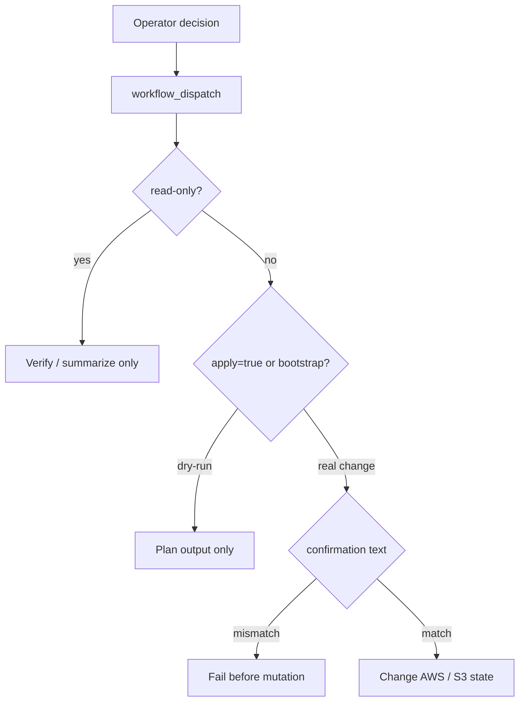

# Manual Infrastructure Workflows

作成日: 2026-06-26 JST
署名: おと（Codex）

## Purpose

公開インフラや正本アーティファクト初期化は、通常の自動収集・公開更新とは
別扱いにする。

ここでいう手動インフラ workflow は次の範囲。

- `bon-odori-site/.github/workflows/configure-custom-domain.yml`
- `bon-odori-site/.github/workflows/configure-contact-form.yml`
- `bon-odori-site/.github/workflows/configure-waf.yml`
- `.github/workflows/bootstrap_master_rdb_s3.yml`
- `.github/workflows/verify_master_rdb_s3.yml`
- `.github/workflows/verify-aws-queue.yml`

## Decision

自動化しない。

理由:

- Route53 / ACM / CloudFront / WAF / SES / Lambda / S3 は、1回の実行が長期状態を変える。
- Domain / contact-form / WAF は、購入済みドメインやDNS状態など、人間が直前確認する前提がある。
- Master RDB S3 bootstrap は初期化・復旧用で、通常運用の定期処理ではない。
- verify系はread-onlyだが、必要時の確認で足りる。通常監査は他の定期workflow内に組み込み済み。

## Guardrail

`apply=false` のdry-runやread-only検証は軽く実行できる状態を保つ。
一方、実変更には明示的な確認文字列を要求する。

## Confirmation Text

| Workflow | Real-change condition | Confirmation |
| --- | --- | --- |
| `configure-custom-domain.yml` | `apply=true` | `APPLY CUSTOM DOMAIN <domain>` |
| `configure-contact-form.yml` | `apply=true` | `APPLY CONTACT FORM contact@bonsuke.jp` |
| `configure-waf.yml` | `apply=true` | `APPLY WAF ERA76BJB7WLEN` |
| `bootstrap_master_rdb_s3.yml` | always publishes | `BOOTSTRAP MASTER RDB S3` |

## Read-only Workflows

Keep these manual and read-only:

- `verify_master_rdb_s3.yml`
- `verify-aws-queue.yml`

They are useful after AWS variable changes, IAM changes, or suspected artifact /
DynamoDB access issues. They should not become scheduled jobs unless they are
converted into a purely summarized health report with no state changes.

## Next Review Candidate

After this theme, the next manual/auto boundary to inspect is X candidate /
social graph workflows. They are manual today because they can spend X API
quota and may write review artifacts.
