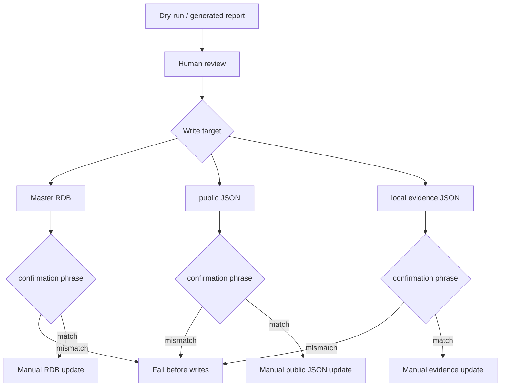

# Master RDB / Public JSON One-Off Operations

作成日: 2026-06-26 JST
署名: おと（Codex）

## Purpose

Master RDBや公開JSONを直接変更する一回限りのapply経路を、
通常の自動postprocessorと混ぜないための運用境界。

## Decision

Keep one-off data mutation scripts manual.

RDBや公開JSONを直接書く手動one-offは、dry-run/reportを確認してから、
明示確認文字列付きで実行する。

## Script Groups

| Group | Scripts | Guard |
| --- | --- | --- |
| Master RDB one-offs | `apply_ph2_shinagawa_second_venue_review.py` | `--apply` requires `APPLY MASTER RDB ONE-OFF` |
| Master RDB one-offs with existing specific phrases | `legacy/apply/apply_ph2_ebara_fifth_rdb.py`, `legacy/apply/apply_gujo_series_merge.py`, `apply_notion_drift_public_intro.py`, `apply_notion_drift_source_url_resolutions.py`, `apply_pre_cutover_p0_historical_references.py`, `apply_predicted_occurrence_source_rechecks.py`, `apply_reviewed_historical_references.py`, `apply_reviewed_missing_occurrence_venues.py`, `apply_reviewed_missing_source_urls.py`, `apply_reviewed_shinagawa_date_fills.py`, `apply_reviewed_venue_field_fixes.py` | `--apply` requires each script's specific confirmation phrase |
| Master RDB derived-table rebuilds | `promotion_candidates/build_historical_promotion_candidates.py`, `promotion_candidates/build_registered_event_investigation_queue.py` | write mode requires `APPLY MASTER RDB ONE-OFF` |
| Public JSON one-offs | `apply_public_event_name_cleanup.py`, `apply_public_official_source_urls.py` | write mode requires `APPLY PUBLIC JSON ONE-OFF` |
| Local evidence one-offs | `apply_youtube_year_backfill_review_decisions.py` | `--apply` requires `APPLY LOCAL EVIDENCE ONE-OFF` |

## Automated Public Postprocessors

These are not classified as manual one-offs:

- `public_json_postprocessors/apply_public_date_predictions.py`
- `public_json_postprocessors/apply_public_historical_references.py`
- `public_json_postprocessors/apply_public_season_hints.py`
- `public_json_postprocessors/apply_public_display_tiers.py`

They are deterministic public-export postprocessors and are called by
`export_public_events.py` as part of the normal generated-output flow.
Scheduled and local maintenance commands should call `export_public_events.py`
instead of chaining these scripts after export.

## Flow

## Automation Boundary

Do not schedule one-off apply scripts.

If the transformation is needed repeatedly, move it into a deterministic
public-export postprocessor or a reviewed Master RDB migration with tests.

## Next Review Candidate

The next manual/auto boundary is remaining report/export/build scripts, such
as `export_*`, `build_*`, `compare_*`, and `audit_*`. They should be separated
into deterministic generated-output jobs, manual verification reports, and any
remaining write paths that need confirmation.
