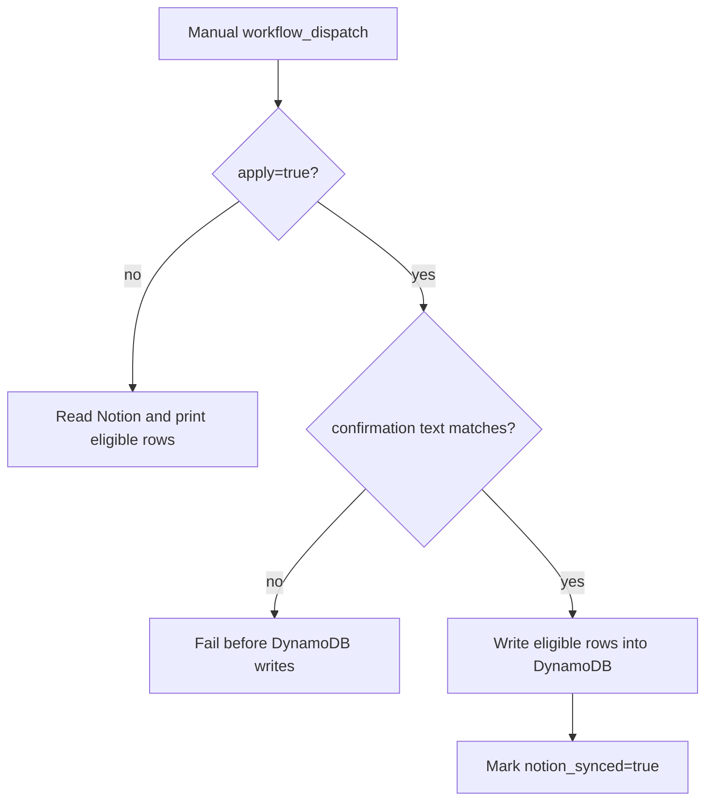

# Notion Queue Migration Operations

作成日: 2026-06-26 JST  
署名: おと（Codex）

## Purpose

`migrate_notion_queue_to_dynamodb.yml` is a legacy one-off migration workflow.

It reads old Notion torimochi queue rows and, only when explicitly applied,
writes eligible rows into the DynamoDB queue.

This is not part of normal daily operations.

## Decision

Keep it manual and normally unused.

Reasons:

- Daily `collect.yml` already writes new queue items to DynamoDB.
- The old Notion queue is no longer the normal operational queue surface.
- Re-running a historical migration should be a deliberate recovery action.
- The migration reads Notion and can write DynamoDB state.

## Flow



## Required Confirmation

Dry-run:

- `apply=false`
- no confirmation required
- reads Notion and prints eligible candidates
- does not write DynamoDB

Apply:

- `apply=true`
- `confirm=MIGRATE NOTION QUEUE TO DYNAMODB`
- writes eligible pre-cutoff Notion rows into DynamoDB

The local script has the same guard:

```bash
python3 migrate_notion_queue_to_dynamodb.py \
  --cutoff 2026-06-07T00:00:00+09:00 \
  --apply \
  --confirm "MIGRATE NOTION QUEUE TO DYNAMODB"
```

## Safety Properties

The migration is conservative:

- dry-run is the default;
- archived and resolved rows are skipped;
- rows created after the cutoff are skipped;
- event-candidate v2 rows are not mixed into the legacy venue queue;
- DynamoDB writes use the normalized candidate key;
- existing DynamoDB rows are not duplicated;
- migrated or already-existing Notion-origin rows are marked
  `notion_synced=true`.

## Automation Boundary

Do not schedule this workflow.

If a future migration is needed, create a new migration with its own runbook,
cutoff, dry-run output, and confirmation text rather than reusing this one as a
generic queue sync.
