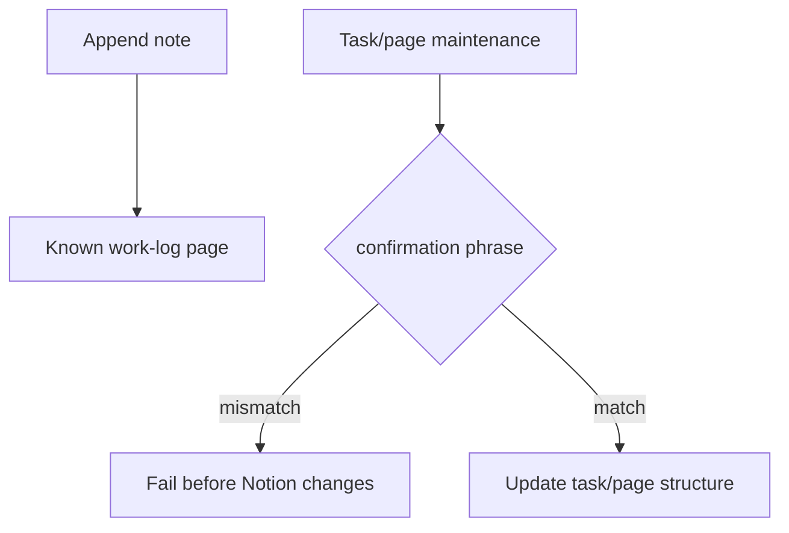

# Notion Work-Log / Task-Page Maintenance Operations

作成日: 2026-06-26 JST
署名: おと（Codex）

## Purpose

Notion work-log scripts are useful for handoff and current-work visibility, but
they should not become hidden data pipelines.

This policy separates lightweight log appenders from scripts that change
existing Notion task/page structure.

## Lightweight Work-Log Appenders

`append_*_note.py` scripts that only append a timestamped note to a known work
page may remain manual note tools without a confirmation phrase.

They are allowed for:

- recording completed work;
- leaving a handoff for Uchida-san / こわ;
- linking runbooks and reports from the current-work page.

They must not update event/venue/song databases or mark task checkboxes.

## Confirmation Required

Scripts that check todos, update existing blocks, create pages, or alter
current-work navigation require:

`APPLY NOTION WORKLOG MAINTENANCE`

| Script | Writes |
| --- | --- |
| `close_youtube_notion_task_checkboxes.py` | checks old YouTube task todos and appends a close note |
| `update_youtube_notion_progress.py` | checks todos and updates progress blocks |
| `update_youtube_followup_progress.py` | checks todos and updates follow-up blocks |
| `create_current_work_index_notion.py` | creates the current-work index page |
| `add_current_work_to_first_look_notion.py` | inserts current-work link into first-look section |
| `rename_current_work_first_look_link_notion.py` | renames a fixed first-look block |
| `create_current_location_notion.py` | renames/updates the current-location page and first-look link |
| `legacy/notion-notes/append_youtube_task_list_to_notion.py` | creates a YouTube task-list page and may archive the old page |

## Automation Boundary

Do not schedule these scripts.

If an automated handoff is needed, write to a dedicated log page or queue with a
clear owner and add it to `docs/manual-auto-operations-inventory.md` first.

