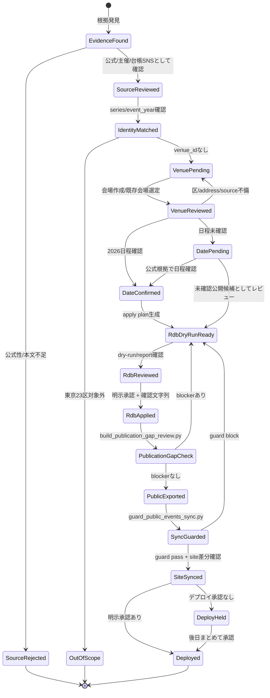
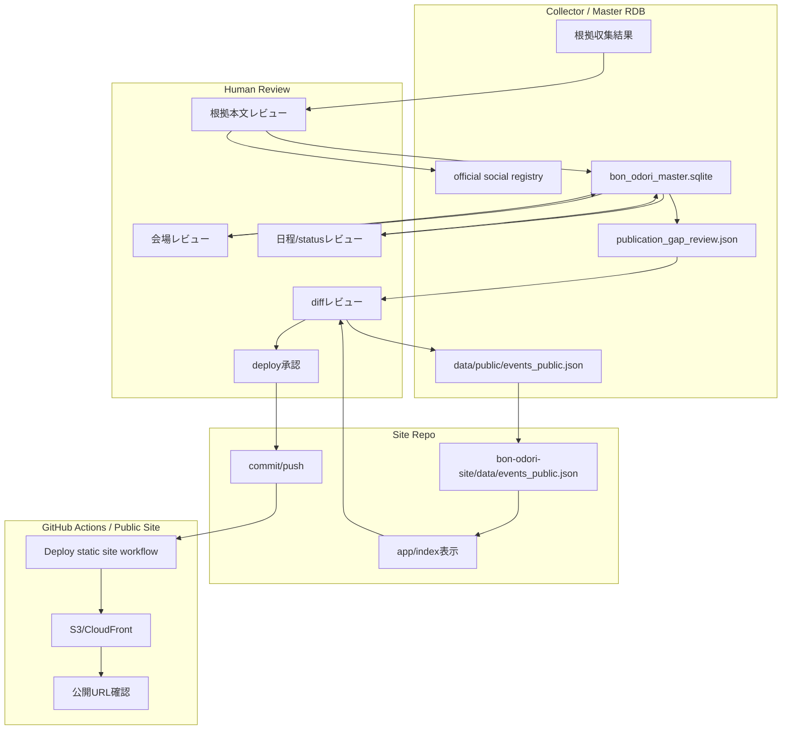
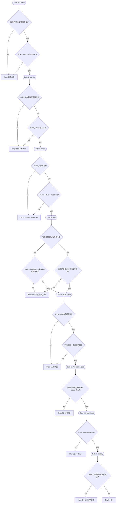
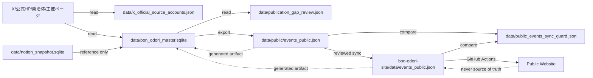

# Public Event Publication Flow

作成日: 2026-06-30 JST
署名: おと（Codex）

## Purpose

根拠が見つかったイベントを、公開サイトへ健全に反映するための正規フロー。

鉄砲洲のように「根拠URLは master RDB に入ったが、会場・日程が未整備で公開JSONに出ない」状態を、見落としではなくレビュー待ちとして管理する。

## Source Of Truth

- 正本は `data/bon_odori_master.sqlite`。
- 公開サイトの `events_public.json` は生成物。
- Notion はこの経路では原則として参照元・旧データであり、RDB更新後に自動で書き戻さない。
- `bon-odori-site/data/events_public.json` や public snapshot を手で直して、master RDB との差分を隠さない。

## Public-Ready Definition

東京23区公開サイトへ通常表示できるイベントは、少なくとも次を満たす。

| Field | Requirement |
| --- | --- |
| `event_occurrences.venue_id` | `venues.venue_id` に接続されている |
| `venues.review_status` | `active` |
| `venues.area` | 東京23区のいずれか |
| `event_occurrences.source_url` or `event_series.source_url` | 公開に使える根拠URLがある。Xの場合は公式/主催SNS台帳登録と投稿本文レビューが必要 |
| `date_start` / `date_end` | 2026年開催日が確認済みなら必ず入れる。未確認イベントは空でもよいが、根拠URLに日程がある場合は空のままにしない |
| `date_status` | 確認済み日程なら `confirmed` |
| `lifecycle_status` | 公開対象として扱える状態にする。`未確認` のまま公開反映しない |

## Normal Flow

1. 根拠を収集する。
   - 公式HP、自治体/主催ページ、登録済み公式/主催SNS投稿を優先する。
   - 未登録SNSは `docs/official-social-source-discovery.md` のレビューを通す。

2. 公開ブロッカーを可視化する。

```sh
python3 build_publication_gap_review.py
```

確認先:

- `data/publication_gap_review.json`
- `summary.event_publication_blocked_count`
- `rows[].domain == "イベント"`
- `rows[].reason_codes`

代表的な `reason_codes`:

| Code | Meaning | Next Action |
| --- | --- | --- |
| `missing_venue_id` | occurrence が会場に接続されておらず、公開エクスポートで落ちる | 会場を登録/選定し、`event_occurrences.venue_id` を更新する |
| `missing_date_start` | 根拠URLはあるが日程が occurrence に入っていない | 投稿/公式ページ本文を確認し、`date_start` / `date_end` / `date_status` を更新する |
| `venue_not_active` | 会場行が公開対象外 | 会場レビューを通して active にするか、公開しない理由を残す |
| `venue_missing_area` | 会場に区情報がない | 会場レビューで区を補完する |

3. レビュー済みの変更だけ master RDB に適用する。
   - 既存の専用 apply script を使う。
   - まず dry-run/report を作る。
   - apply は確認文字列つきで実行し、バックアップとレポートを残す。
   - 使うスクリプトと確認文字列は `docs/master-rdb-public-json-one-off-operations.md` を優先する。

4. 公開JSONを再生成する。

```sh
python3 export_public_events.py
```

5. 公開同期前ガードを通す。

```sh
python3 guard_public_events_sync.py
```

`guard_public_events_sync.py` の pass は「同期差分にブロッカーがない」という意味であり、デプロイ承認ではない。
`procedure_warnings` が出た場合は、RDB更新後の `build_publication_gap_review.py` または `export_public_events.py` が未実行の可能性があるため、公開同期・デプロイ前に解消または明示レビューする。

6. site repo へ同期して差分確認する。
   - 追加バッチでは、`bon-odori-collector/data/public/events_public.json` を丸ごとコピーしない。
   - `sync_public_event_additions_to_site.py` で、追加対象イベントだけを `bon-odori-site/data/events_public.json` へ同期する。
   - `guard_site_public_event_additions.py` で、site側差分が「指定したイベントの追加だけ」になっていることを確認する。

7. デプロイは別承認で行う。
   - 細かい修正は原則まとめて反映する。
   - 内田さんが「今すぐWebへ反映」と明示した場合だけ公開デプロイへ進む。

## Addition Batch Commands

公式確認済みイベントを少しずつ増やす通常運用では、このコマンド列を使う。
`events_public.json` の丸ごとコピーは、既存公開データの根拠URL・曲情報・後処理済みフィールドを落とす可能性があるため使わない。

1. 公開ブロッカーを更新する。

```sh
python3 build_publication_gap_review.py
```

2. master RDB へ、レビュー済みの小バッチだけを反映する。
   - 会場だけ足りない場合:

```sh
python3 apply_reviewed_missing_occurrence_venues.py --occurrence-id <occurrence_id>
python3 apply_reviewed_missing_occurrence_venues.py --occurrence-id <occurrence_id> --apply --confirm "APPLY REVIEWED MISSING OCCURRENCE VENUES"
```

   - 日付・会場・名称をまとめて確定する場合は、専用 apply script を作る。既存例は `apply_reviewed_official_wait_events.py`。

3. 公開JSONを再生成する。

```sh
python3 export_public_events.py
python3 build_publication_gap_review.py
python3 review_missing_occurrence_venues.py
python3 run_review_console.py --inventory
```

4. site repo へ、追加対象イベントだけを同期する。

```sh
python3 sync_public_event_additions_to_site.py \
  --event-name "鉄砲洲納涼盆踊り" \
  --event-name "すみだ河内音頭 小盆踊り"

python3 sync_public_event_additions_to_site.py \
  --event-name "鉄砲洲納涼盆踊り" \
  --event-name "すみだ河内音頭 小盆踊り" \
  --write --confirm "SYNC PUBLIC EVENT ADDITIONS"
```

5. 同期後ガードを通す。

```sh
python3 guard_public_events_sync.py --report-only

python3 guard_site_public_event_additions.py \
  --expected-event-name "鉄砲洲納涼盆踊り" \
  --expected-event-name "すみだ河内音頭 小盆踊り"
```

`guard_public_events_sync.py` は collector と site の整合を見る。
`guard_site_public_event_additions.py` は site repo の作業差分が追加だけかを見る。
両方が pass してもデプロイ承認ではない。デプロイは内田さんの明示承認後に行う。

## Stop Rules

次のいずれかに当たる場合は、公開反映へ進まない。

- 根拠がまとめサイト・個人投稿だけで、公式/主催/町会/自治体として確認できない。
- `date_start` が根拠本文から確認できないのに `confirmed` にしようとしている。
- 会場名は推定できるが、住所・区・公式施設根拠が確認できない。
- `publication_gap_review.json`、`missing_occurrence_venue_review.json`、review console inventory のいずれかに対象イベントが戻っている。
- `guard_site_public_event_additions.py` が `modified_existing_public_events` または `removed_existing_public_events` を出す。

## Detailed Flow Diagram

この図を正規フローの一次参照にする。迷った場合は、図の左から右へ進め、赤い stop / hold に入ったものを公開JSONで手直しして進めない。

```mermaid
flowchart LR
  start([Start: 新しいイベント根拠を発見])

  subgraph collect[1. Evidence Collection]
    source_type{根拠の種類}
    official[公式HP・自治体・主催ページ]
    registered_social[登録済み公式/主催SNS投稿]
    candidate_social[未登録SNS・町会らしき投稿]
    youtube[YouTube・動画・過去実績]
    weak[まとめサイト・個人ブログ・弱い投稿]

    source_type --> official
    source_type --> registered_social
    source_type --> candidate_social
    source_type --> youtube
    source_type --> weak
  end

  start --> source_type

  candidate_social --> social_review[公式/主催SNS台帳レビュー]
  social_review --> social_gate{台帳登録できるか}
  social_gate -- yes --> registered_social
  social_gate -- no --> hold_social[[Hold: candidate_official_social のまま確定根拠にしない]]

  youtube --> historical_only[[Historical reference only: 未来/今年の確定日には使わない]]
  weak --> weak_review[補助根拠として個別レビュー]

  official --> evidence_record[根拠URL・本文・取得日時を記録]
  registered_social --> post_body_review[投稿本文レビュー: イベント名/日付/会場/時間]
  post_body_review --> post_body_gate{本文に公開必要情報が揃うか}
  post_body_gate -- yes --> evidence_record
  post_body_gate -- no --> hold_social_post[[Hold: 投稿本文不足。公開確定根拠にしない]]
  weak_review --> weak_gate{公式相当として扱えるか}
  weak_gate -- no --> hold_weak[[Hold: 調査メモのみ]]
  weak_gate -- yes --> evidence_record

  subgraph identify[2. Identity And Scope Review]
    event_identity[イベント名・series_keyを確認]
    year_identity[event_year と開催回を確認]
    scope_gate{東京23区公開対象か}
    duplicate_gate{既存series/occurrenceと重複しないか}
    duplicate_merge[既存series/occurrenceへ統合]
    new_series[新規series/occurrence候補]
  end

  evidence_record --> event_identity --> year_identity --> scope_gate
  scope_gate -- no --> outside_scope[[Hold: 23区公開対象外。全国/参考データへ分離]]
  scope_gate -- yes --> duplicate_gate
  duplicate_gate -- duplicate --> duplicate_merge
  duplicate_gate -- new --> new_series

  subgraph venue[3. Venue Review]
    venue_found{会場は既存venuesにあるか}
    venue_match[既存venue_idを選定]
    venue_create_review[新規会場レビュー]
    venue_fields[会場名/区/address/access/scale/source_urlを確認]
    venue_active_gate{venues.review_status == active か}
    venue_ready[venue_id ready]
  end

  duplicate_merge --> venue_found
  new_series --> venue_found
  venue_found -- yes --> venue_match --> venue_active_gate
  venue_found -- no --> venue_create_review --> venue_fields --> venue_active_gate
  venue_active_gate -- yes --> venue_ready
  venue_active_gate -- no --> hold_venue[[Hold: 会場未レビュー。missing_venue_id / venue_not_active]]

  subgraph date[4. Date And Status Review]
    date_in_source{根拠本文に2026日程があるか}
    date_parse[date_start/date_end を抽出]
    time_note[時間は detail/public note に保存]
    date_status_confirmed[date_status=confirmed]
    lifecycle_publishable[lifecycle_statusを公開可能状態へ]
    date_unknown[date_start空のまま。日程未確認扱い]
  end

  venue_ready --> date_in_source
  date_in_source -- yes --> date_parse --> time_note --> date_status_confirmed --> lifecycle_publishable
  date_in_source -- no --> date_unknown

  subgraph apply[5. Reviewed Master RDB Apply]
    dry_run[専用scriptでdry-run/report生成]
    human_review[Koto/内田さんレビュー]
    apply_gate{apply承認と確認文字列あり?}
    rdb_apply[master RDB apply]
    backup[backup/reportを保存]
  end

  lifecycle_publishable --> dry_run
  date_unknown --> dry_run
  dry_run --> human_review --> apply_gate
  apply_gate -- no --> hold_apply[[Stop: applyしない]]
  apply_gate -- yes --> rdb_apply --> backup

  subgraph gap[6. Publication Gap Review]
    gap_build[python3 build_publication_gap_review.py]
    gap_json[data/publication_gap_review.json]
    blocker_gate{イベントblockerが残るか}
    p0_gate{P0: missing_venue_id など}
    p1_gate{P1: missing_date_start など}
  end

  backup --> gap_build --> gap_json --> blocker_gate
  blocker_gate -- no --> export_step
  blocker_gate -- yes --> p0_gate
  p0_gate -- yes --> hold_p0[[Stop: 公開同期禁止。会場/occurrenceを修正]]
  p0_gate -- no --> p1_gate
  p1_gate -- yes --> review_p1[[Review: 未確認として出すか、日程反映してから出すか判断]]

  subgraph export[7. Public Export And Site Sync]
    export_step[python3 export_public_events.py]
    postprocessors[public postprocessors]
    sync_guard[python3 guard_public_events_sync.py]
    guard_gate{guard status pass?}
    site_sync[collector -> bon-odori-site sync]
    site_diff[site diff review]
  end

  review_p1 --> export_step
  export_step --> postprocessors --> sync_guard --> guard_gate
  guard_gate -- no --> hold_guard[[Stop: syncしない。差分をレビュー]]
  guard_gate -- yes --> site_sync --> site_diff

  subgraph deploy[8. Deploy Approval]
    deploy_gate{内田さんが公開反映を明示承認?}
    commit_push[site repo commit/push]
    actions[GitHub Actions Deploy static site]
    verify[公開URLで確認]
  end

  site_diff --> deploy_gate
  deploy_gate -- no --> local_done[[Done: ローカル/PR準備まで]]
  deploy_gate -- yes --> commit_push --> actions --> verify --> done([Done])
```



## State Machine

イベント occurrence の状態は、この状態遷移で管理する。状態を飛ばして公開JSONへ直接入れない。



## Swimlane: Who Owns What



## Gate Checklist

各ゲートで見るものを固定する。



## Data Ownership Map

どのファイル/テーブルをどの段階で読む・書くか。



## Anti-Patterns

- 公開JSONを手で直して master RDB の未整備を隠す。
- source_url だけを入れて、会場・日程・status を更新したつもりにする。
- `event_investigation_tasks` の古い `missing_date` / `missing_venue` を見ずに公開済み扱いにする。
- `candidate_official_social` のまま、X投稿を確認済み根拠として公開する。
- `guard_public_events_sync.py` の pass をデプロイ承認として扱う。

## Teppozu Reference Case

2026-06-30時点の鉄砲洲:

- `event_series`: あり
- `event_occurrences`: あり
- `source_url`: `https://x.com/iri2choukai/status/2069959259895496872`
- `venue_id`: 空
- `date_start`: 空
- `date_status`: `unknown`
- `lifecycle_status`: `未確認`
- `data/publication_gap_review.json`: `event_publication_blocked` / `P0`

正規の次アクション:

1. `@iri2choukai` 投稿本文と公式/主催SNS台帳を確認する。
2. `鉄砲洲公園` の会場行をレビューして作成/接続する。
3. `date_start=2026-08-03`, `date_end=2026-08-05`, `date_status=confirmed` を occurrence に反映する。
4. `export_public_events.py` と `guard_public_events_sync.py` を通す。
5. site repo に同期し、公開デプロイは別承認で進める。
