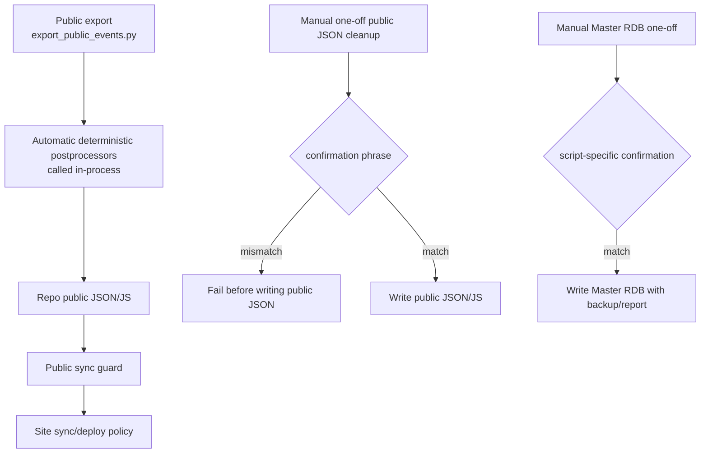

# Public JSON Postprocessor / One-Off Apply Operations

作成日: 2026-06-26 JST
署名: おと（Codex）

## Purpose

Some scripts named `apply_public_*` are normal deterministic postprocessors for
`data/public/events_public.json`. Others are one-off cleanup tools.

This document separates the two so scheduled public data generation does not
break, while ad hoc public JSON edits still require explicit intent.

## Automatic Postprocessors

Keep these automatic:

| Script | Why automatic |
| --- | --- |
| `public_json_postprocessors/apply_public_date_predictions.py` | attaches reviewed rule predictions to public JSON after export |
| `public_json_postprocessors/apply_public_historical_references.py` | attaches historical-reference display fields after export |
| `public_json_postprocessors/apply_public_season_hints.py` | attaches low-confidence season hints after export |

They are called inside `export_public_events.py`. Scheduled workflows and local
YouTube backfill maintenance call `export_public_events.py` as the single public
JSON generation path, rather than running these scripts as a follow-up chain.

They write repo-local public JSON/JS only. They do not write Notion, S3,
CloudFront, or Master RDB. Public deploy remains guarded separately by the site
sync/deploy workflows.

Before changing this chain or moving these fields into the RDB-side public
projection, run the diff-zero comparison:

```sh
python3 scripts/compare_public_export_postprocessors.py --today 2026-07-16
```

The comparison writes only to temporary directories and reports whether the
current export and the legacy overlay produce identical public event JSON.
In a temporary worktree without `data/bon_odori_master.sqlite`, pass
`--master-db /path/to/bon_odori_master.sqlite`.

## Manual Public JSON One-Offs

These are not scheduled. Public JSON writes require:

`APPLY PUBLIC JSON ONE-OFF`

| Script | Default | Write condition |
| --- | --- | --- |
| `apply_public_event_name_cleanup.py` | dry-run plan | `--apply --confirm "APPLY PUBLIC JSON ONE-OFF"` |
| `apply_public_official_source_urls.py` | writes unless `--dry-run` | `--confirm "APPLY PUBLIC JSON ONE-OFF"` |

## Manual Master RDB One-Offs

These already have separate confirmation phrases and backup/dry-run behavior.
Keep them manual:

| Script | Confirmation |
| --- | --- |
| `apply_pre_cutover_p0_historical_references.py` | `APPLY PRE CUTOVER P0 HISTORICAL REFERENCES` |
| `apply_reviewed_historical_references.py` | `APPLY REVIEWED HISTORICAL REFERENCES` |
| `legacy/apply/apply_ph2_ebara_fifth_rdb.py` | `APPLY PH2 EBARA FIFTH RDB` |

## Flow



## Automation Boundary

Do not add schedules around manual public JSON one-offs or Master RDB one-offs.

If a manual public JSON cleanup becomes a normal invariant, move it into
`export_public_events.py` or the automatic postprocessor chain with tests.
