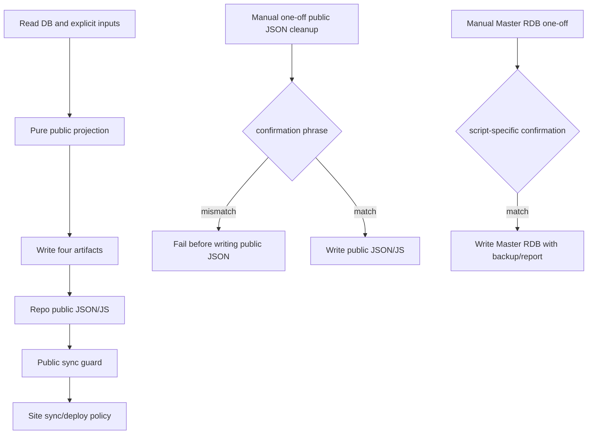

# Public JSON Postprocessor / One-Off Apply Operations

作成日: 2026-06-26 JST
署名: おと（Codex）

## Purpose

Public display rules run inside one exporter. Input reading, pure projection,
and artifact writing are separate stages; ad hoc JSON edits remain manual.

## Automatic Postprocessors

Keep these automatic:

| Script | Why automatic |
| --- | --- |
| `public_export_support/date_predictions.py` | computes reviewed prediction display fields |
| `public_export_support/historical_references.py` | computes historical reference and slide fields |
| `public_export_support/season_hints.py` | computes season display hints |

`export_public_events.py` loads `PublicProjectionInputs`, passes explicit values
to `project_public_events()`, then calls `write_public_projection()`. The pure
projection does not read files or DB, consult the environment, or mutate inputs.
Scheduled workflows, review-inbox digest, and state-axis migration use this same
projection. The three rule modules have no standalone writer CLI.

The writer produces events JSON/JS, song JSON, and an internal source-map sidecar.
Public deploy remains guarded separately by the site sync/deploy workflows.
The sync guard compares the actual collector JSON and cannot regenerate missing
historical/season fields to rescue a failing input.

For a structural refactor, compare frozen old/new code with the same captured
input bundle using `scripts/compare_public_projection_revisions.py`; see the
[migration plan](public-json-rdb-projection-migration-plan.md). The additional
overlay idempotence check remains available:

```sh
python3 scripts/compare_public_export_postprocessors.py --today 2026-07-16
```

The comparison writes to temporary directories and compares all four artifacts.
The old `apply_public_date_predictions.py`, `apply_public_historical_references.py`,
and `apply_public_season_hints.py` CLIs live only under `legacy/public_projection/`
as frozen comparison fixtures. They are not production entrypoints.
In a temporary worktree without `data/bon_odori_master.sqlite`, pass
`--master-db /path/to/bon_odori_master.sqlite`.

## Manual Public JSON One-Offs

These are not scheduled. Public JSON writes require:

`APPLY PUBLIC JSON ONE-OFF`

| Script | Default | Write condition |
| --- | --- | --- |
| `apply_public_event_name_cleanup.py` | dry-run plan | `--apply --confirm "APPLY PUBLIC JSON ONE-OFF"` |
| `apply_public_official_source_urls.py` | writes unless `--dry-run` | `--confirm "APPLY PUBLIC JSON ONE-OFF"` |

## Manual Master RDB One-Offs

These already have separate confirmation phrases and backup/dry-run behavior.
Keep them manual:

| Script | Confirmation |
| --- | --- |
| `apply_pre_cutover_p0_historical_references.py` | `APPLY PRE CUTOVER P0 HISTORICAL REFERENCES` |
| `apply_reviewed_historical_references.py` | `APPLY REVIEWED HISTORICAL REFERENCES` |
| `legacy/apply/apply_ph2_ebara_fifth_rdb.py` | `APPLY PH2 EBARA FIFTH RDB` |

## Flow



## Automation Boundary

Do not add schedules around manual public JSON one-offs or Master RDB one-offs.

If a manual public JSON cleanup becomes a normal invariant, move it into
the pure projection in `export_public_events.py` with tests.
