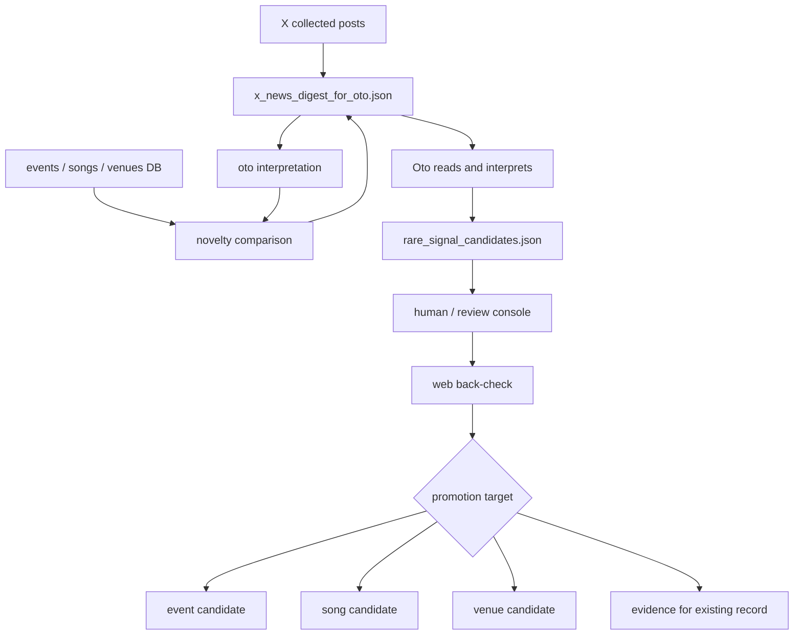

# X Interpreted News Discovery Plan

作成日: 2026-06-27 JST
署名: おと（Codex）

## Purpose

X由来の毎日の情報を、X投稿の丸コピーとして扱うのではなく、おとが読んで
「イベント・曲・会場に関する新規情報か」を解釈し、盆助の候補へ変換する。

佐竹ゲバゲバ盆踊りの例では、「40年ぶり復活」という固定キーワードが重要なのではない。
重要なのは、X投稿に含まれていたイベント情報を人間が読み、過去のイベント・曲・会場と
照らして「これは既存DBにない、価値のある情報だ」と判断できたこと。

今後はこの判断を、日次ニュース生成の一部としておとが担当する方向へ寄せる。

## Problem

既存のX収集は、投稿を `voices.json` に蓄積し、一次レポ・関心・日程候補として扱っている。
しかし、次の問題がある。

- 固定キーワードでは、価値ある新規情報を十分に拾えない。
- 投稿本文を並べるだけでは、Xを見ている体験との差が小さい。
- X投稿の丸コピーに依存すると、将来的にXの運用会社の方針や利用条件と合わなくなるリスクがある。
- 盆助の価値は、投稿そのものではなく、投稿を読んだ上での「解釈」「照合」「裏どり」「登録判断」にある。

## Direction

`rare_signal` は「希少キーワード候補」ではなく、「おとが解釈した新規情報候補」として扱う。

検知したいもの:

- 新しいイベントらしきもの。
- 既存イベントの今年開催日、場所、主催、規模、曲目などの更新。
- 既存DBにない会場。
- 既存曲マスタにない曲名、地域音頭、踊り名。
- 既存イベントと同名だが、別会場・別主催・別年次文脈の可能性があるもの。
- 既存イベントに追加すべき歴史的文脈、雰囲気、曲傾向、現場情報。

固定語彙は補助信号に留める。
本体は、投稿を読んで構造化し、既存DBと照合して差分を見ること。

## Editorial Boundary

X由来の情報を公開・配信に使う場合は、次を守る。

- X投稿本文をそのまま長く転載しない。
- 公開文は、おとの解釈・要約・裏どり結果として書く。
- 出典URLは内部証拠として保持するが、公開リンクにするかはソース種別と運用方針で分ける。
- Xだけで確定扱いにしない。開催日・場所・主催などの確定には、公式、自治体、主催、準公式、複数証拠を優先する。
- Xの価値は「発見」「現場感」「人間の気づき」であり、盆助の価値は「整理」「照合」「裏どり」「登録」に置く。

## Proposed Flow



## Oto Interpretation Task

毎日のX由来ニュースについて、おとは次を行う。

1. 投稿群を読む。
2. 投稿ごとに「何についての情報か」を分類する。
3. イベント名・会場名・曲名・日付・地域・主催らしき語を抽出する。
4. 既存イベント、既存曲、既存会場と照合する。
5. 既存にない、または既存と食い違う情報だけを候補化する。
6. 候補ごとに、裏どり検索クエリと人間レビュー用の短い判断理由を作る。

分類:

- `new_event_candidate`
- `event_update_candidate`
- `new_song_candidate`
- `song_usage_candidate`
- `new_venue_candidate`
- `historical_context_candidate`
- `atmosphere_or_scale_evidence`
- `noise_or_duplicate`

## Candidate Record

`x_news_digest_for_oto.json` は、おとが読む前の機械下ごしらえを保存する。
`rare_signal_candidates.json` は、おとが読んで解釈した後の候補を保存する。
`rare_signal_backcheck_queue.json` は、rare signal候補からWeb裏どり待ちだけを抜き出した確認キューとして保存する。

- `candidate_id`
- `detected_at`
- `source_type`: `x_post`, `x_digest`, `web`, `rss`, `youtube`, `manual`
- `source_urls`
- `source_authors`
- `source_text_excerpt`: 短い内部確認用抜粋。公開用本文には使わない。
- `machine_digest_summary`: おとが読む前の機械ヒント。確定解釈ではない。
- `oto_review_status`: `pending`, `reviewed`
- `oto_interpreted_summary`: おとが読んだ後の要約。
- `information_type`
- `possible_event_name`
- `possible_venue`
- `possible_area`
- `possible_date_text`
- `possible_song_names`
- `matched_existing_events`
- `matched_existing_venues`
- `matched_existing_songs`
- `novelty_assessment`: `new`, `update`, `known`, `conflict`, `unclear`
- `novelty_reason`
- `confidence`
- `web_backcheck_queries`
- `review_status`: `new`, `needs_backcheck`, `confirmed`, `rejected`, `hold`
- `promotion_target`: `event`, `song`, `venue`, `existing_evidence`, `none`

## Back-check Queue

`rare_signal_candidates.json` は「おとが読んで価値がありそうだと判断した候補」であり、
そのまま公開DBやNotionへ確定反映しない。

手動で見つけた重要X投稿は `register_manual_x_missed_signal.py` で登録する。
これはX本文取得に依存せず、URLと内田さん/おとの要約を保存する。

出力:

- `data/manual_x_missed_signals.json`: 見逃しURLの正本ログ。
- `data/manual_x_missed_signals.md`: 人間確認用一覧。
- `data/manual_x_rare_signal_candidates.json`: rare signal裏どりへ渡す手動候補。
- `data/x_manual_account_candidates.json`: 今後のX収集メンバー候補。

例:

```bash
python3 register_manual_x_missed_signal.py \
  --url 'https://x.com/kagurazaka_6/status/2067528339074830638' \
  --summary '神楽坂エリアの重要なイベント情報として手動追加。非X根拠で裏どりする。' \
  --event-name '神楽坂エリアの重要イベント情報' \
  --area '神楽坂' \
  --query '神楽坂 イベント 盆踊り 公式'
```

この登録は、イベント確定ではない。
`manual_x_rare_signal_candidates.json` は `build_rare_signal_backcheck_queue.py` が
通常のrare signal候補と合わせて読み込み、`rare_signal_backcheck_queue` に出す。

`build_rare_signal_backcheck_queue.py` が `rare_signal_backcheck_queue.json` と
`rare_signal_backcheck_queue.md` を生成する。

`search_rare_signal_backcheck_sources.py` は、裏どりキューの `search_queries` を使って
非Xの候補URLを探し、`rare_signal_backcheck_search_results.json` と
`rare_signal_backcheck_search_results.md` を生成する。
これは確認作業の補助であり、候補を確定しない。
検索結果はノイズを含むため、人間またはレビューコンソールで公式/主催/自治体/会場/地域媒体などの
根拠として使えるかを確認する。

初期運用ではイベント候補が多くなりやすいため、曲・会場・既存証拠がレビュー順で埋もれないようにする。
`build_x_news_digest_for_oto.py` は `event_update` の次に曲候補・会場候補を並べ、
`build_rare_signal_backcheck_queue.py` はデフォルトで
`event,song,venue,existing_evidence` を裏どり対象にする。
特定用途で絞る場合だけ `--include-targets event` のように指定する。

裏どりキューの原則:

- Xは発見ソースであり、確定ソースではない。
- `oto_interpreted_summary` を確認作業の中心にする。
- X本文抜粋は公開文に使わない。
- 確定には公式、主催、自治体、会場、地域媒体など非Xソースを優先する。
- 自動検索で確認できなかった候補は、却下ではなく `pending` のまま人間確認へ回す。
- 自動検索で非X候補URLが見つかっても、それだけで `confirm` にはしない。

裏どり結果は `data/rare_signal_backcheck_reviews.json` に別保存する。
キューファイルは日次生成物なので、直接レビュー結果を書き込まない。

最小形:

```json
{
  "reviews": [
    {
      "candidate_id": "xoto_...",
      "decision": "confirm",
      "confirmed_source_urls": ["https://example.jp/event"],
      "confirmed_source_type": "official_or_organizer",
      "venue": "確認済み会場名",
      "date_text": "2026年8月1日",
      "public_summary": "公開文の元になる確認済み要約。"
    }
  ]
}
```

`stage_rare_signal_backcheck_reviews.py` は、`confirm` かつ非Xの
`confirmed_source_urls` がある行だけを `rare_signal_registration_candidates.json`
へステージする。

このステージングも実反映ではない。
Master RDB、Notion、公開JSONへは書かず、後続の登録レビュー/個別applyへ渡すための
候補パケットとして扱う。

レビューコンソールでは `rare_signal_backcheck` ソースとして表示する。

- `非X根拠で確認済み`: メモ欄に公式/主催/自治体/会場/地域媒体などのURLを貼る。
- `非X根拠を追加調査`: X発見として保留し、確認URL探索を続ける。
- `却下`: 重複、ノイズ、載せる粒度ではない場合。
- `保留`: 判断材料が足りない場合。

`python3 -m review_console_ops.apply_review_console_decisions --write` で
`data/review_console/staged/rare_signal_backcheck_decisions.json` が出たら、
`export_rare_signal_backcheck_reviews.py` が `data/rare_signal_backcheck_reviews.json`
へ変換する。メモ欄のURLから非X URLだけを抽出し、X URLだけの場合は `confirm` ではなく
`hold` に戻す。

検索候補だけを先に作る場合:

```bash
python3 search_rare_signal_backcheck_sources.py --limit-candidates 17 --queries-per-candidate 2 --sleep-seconds 0.2
```

出力された `rare_signal_backcheck_search_results.md` は、レビューコンソールで
`rare_signal_backcheck` を見る前の探索メモとして使う。
このファイルから本番登録候補へ直接進めない。

## Novelty Comparison

照合対象:

- 公開イベントJSON。
- Master RDBのイベント、会場、曲。
- 過去年実績、YouTube由来の曲実績。
- 既存X evidence、review queue、DynamoDB候補。
- 用語集/曲マスタの別名。

判定の考え方:

- 同じイベント名・会場・日付が既にあるなら、候補ではなく証拠追加に回す。
- イベント名だけ一致し、会場や日付が違う場合は、同名別イベントまたは年次更新として保留する。
- 曲名だけ新しい場合は、イベント候補ではなく曲候補・曲使用候補にする。
- 会場だけ新しい場合は、会場候補または既存イベントの会場差分として扱う。
- 日付がなくても、イベント・曲・会場のどれかが新規なら候補に残してよい。

## Review UX

レビュー画面では、X投稿そのものではなく、おとの解釈結果を中心に表示する。

表示するもの:

- おとの要約。
- 何が新規・差分だと思ったか。
- 既存DBとの近い一致。
- 裏どり検索クエリ。
- 内部確認用の短い出典抜粋とURL。
- 昇格先候補: イベント、曲、会場、既存証拠。

レビュー操作:

- `裏どりへ`
- `新規イベント候補へ`
- `既存イベントに証拠追加`
- `新規曲候補へ`
- `新規会場候補へ`
- `保留`
- `却下`

## Implementation Plan

Phase 1: 企画とサンプル固定

- この設計を `rare_signal` の正とする。
- 佐竹ゲバゲバ盆踊りをサンプル候補として、期待JSONを1件作る。
- X本文丸コピーではなく、おとの `oto_interpreted_summary` を主情報にする。

Phase 2: 既存データだけで後処理

- `data/voices.json` のX由来投稿を入力にする。
- 新規X API探索は増やさない。
- 既存イベント・曲・会場との照合で `x_news_digest_for_oto.json` を生成する。
- まずはルール＋既存正規化で、おとが読む対象を絞る。これを確定解釈とは扱わない。

Phase 3: おと解釈ジョブ

- 日次ニュース配信用にX投稿を読むタイミングで、`x_news_digest_for_oto.json` をおとが読む。
- おとの読解結果は `x_news_digest_oto_reviews.json` に別保存する。
- `promote_x_news_digest_reviews.py` が、review済みかつ昇格判断のある行だけを `rare_signal_candidates.json` へ昇格する。
- 出力はレビュー用JSON/MDに限定し、Notionや公開JSONへは直書きしない。
- 候補数、採用率、重複率を記録する。

Phase 4: レビューコンソール統合

- `rare_signal` レーンを追加する。
- イベント・曲・会場・既存証拠の4方向にステージできるようにする。
- 確定後は通常の候補適用フローへ渡す。

## Operations Boundary

X APIの収集範囲は当面増やさない。
まず、既に取れているX由来ニュースをおとが解釈する。

Notion、Master RDB、公開JSONへの直接反映はしない。
レビュー後に既存の適用フローへ進める。

## Immediate Next Steps

1. `rare_signal` の意味を「固定キーワード」から「おと解釈済み新規情報候補」に変更する。
2. `build_x_news_digest_for_oto.py` の初版は、既存 `voices.json` と公開イベント/曲/会場データを照合する後処理にする。
3. 佐竹ゲバゲバ盆踊りをサンプルとして、機械下ごしらえと、おと解釈後の期待形を分ける。
4. 日次ニュース配信の前処理または同時処理として、おとがX由来情報を読む運用に接続する。
5. X本文の転載は禁止め、公開・配信用には必ずおとの要約と裏どり結果を使う。

## Oto Review File

`data/x_news_digest_oto_reviews.json` は、日次生成で上書きされる
`x_news_digest_for_oto.json` とは分ける。

最小形:

```json
{
  "reviews": [
    {
      "candidate_id": "xoto_...",
      "decision": "promote",
      "oto_interpreted_summary": "公開文の元になる、おとの要約。",
      "oto_novelty_assessment": "new",
      "promotion_target": "event",
      "oto_notes": "内部メモ"
    }
  ]
}
```

`decision` は `promote` / `hold` / `reject` を使う。
`promote` でも `oto_interpreted_summary` が空なら昇格しない。
