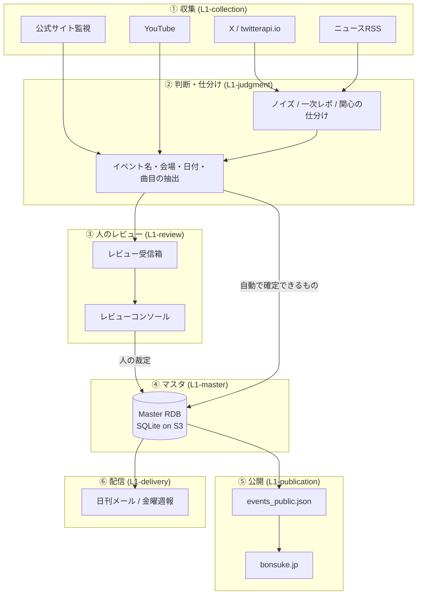

# 盆助 全体地図

盆助（ぼんすけ、https://bonsuke.jp ）は、東京23区の盆踊りの開催情報を自動で集めて公開する仕組みである。
Claude や Codex が動いていない時間も GitHub Actions が自律的に走り、収集・判断・公開までが毎日回る。

このページは**最初に開く1枚**で、目的は「いまどこの話をしているのか」を決めることだけ。
詳しいことは何も書かない。当たりをつけたら L1 へ降りる。

- 仕様書そのものの読み方・書き方は [SPEC-GUIDE](SPEC-GUIDE.md) にある。**仕様書を書き足す前に必ず読む。**
- ファイルを触るのが先に決まっているなら、このページではなく `index.json` の逆引きを使う。

## 何を解いている仕組みか

盆踊りの開催情報は、驚くほど**どこにもまとまっていない**。町会の掲示板、神社の貼り紙、区の広報、
主催者のX投稿にばらばらに存在し、多くは開催の数週間前にならないと出てこない。しかも毎年ほぼ同じ時期に、
ほぼ同じ場所で開かれるのに、その「例年こうだ」という知識もどこにも書かれていない。

盆助は、この散らばった断片を機械が集め、確からしさを判断し、
**確定した情報と、まだ推測でしかない情報を区別したまま**公開する。区別を保つことが設計の中心にある。
「たぶん去年と同じ日だろう」を確定情報として出してしまえば、人を存在しない盆踊りへ歩かせることになるからだ。

## 全体の流れ

矢印のうち **`CONSOLE -->|人の裁定| RDB` が律速**である。集めることでも判断することでもなく、
人が裁定を下す速度が全体の速度を決めている。機械の精度を上げる前に、まずこの工程が詰まっていないかを見るのが正しい。

## サブシステム一覧

| L1 | 担当 | いちばんの関心事 | 詳細 |
|---|---|---|---|
| ① 収集 | X・RSS・公式サイト・YouTube から断片を集める | 取りこぼした原文は復元できないこと | [01-collection](L1/01-collection.md) |
| ② 判断・仕分け | 断片からイベント・会場・日付を取り出す | 採点の理由を説明できる形で残すこと | [02-judgment](L1/02-judgment.md) |
| ③ 人のレビュー | 機械が決められないものを人が裁定する | 詰まらせないこと（ここが律速） | [03-review](L1/03-review.md) |
| ④ マスタ | 確定した事実の正本を保つ | 確定と推測を混ぜないこと | [04-master](L1/04-master.md) |
| ⑤ 公開 | 公開JSONを作り、サイトへ届ける | 危ないときに止まれること | [05-publication](L1/05-publication.md) |
| ⑥ 配信 | 日刊メール・金曜週報 | 送ってしまうと取り消せないこと | [06-delivery](L1/06-delivery.md) |
| ⑦ 基盤 | GitHub Actions・AWS・認証・成果物の受け渡し | 誤った経路での実行を止めること | [07-platform](L1/07-platform.md) |
| ⑧ 曲目 | その盆踊りで何が踊られるかを集め、確からしさを添えて出す | 曲名でないものを曲名として出さないこと | [08-songs](L1/08-songs.md) |
| ⑨ YouTube | 動画から過去の開催と曲目を掘り起こす | 証拠を確定として公開へ流さないこと | [09-youtube](L1/09-youtube.md) |
| ⑩ 会場 | 会場を見つけ、候補を整え、レビュー済みのものを開催回へ結ぶ | 似た名前の別会場を一つにまとめないこと | [10-venues](L1/10-venues.md) |
| ⑪ 用語集・別名 | 界隈語と別名を、日次が読める辞書へ展開する | 未レビューの語を日次の判定へ入れないこと | [11-glossary](L1/11-glossary.md) |

⑧〜⑪だけ切り口が違う。①〜⑦が**工程**で切ってあるのに対し、この4つは**ドメイン**で切ってある。
どれも収集から公開までを縦に貫いていて、どの工程へ入れても話が半分になってしまうためで、
理由はそれぞれの「主要な流れ」の冒頭に書いてある。

## L2（データの正確な形）

L1が「何に責任を持ち、何を壊してはいけないか」なのに対し、L2は**データそのものの形**を扱う。
工程どうしが受け渡すものの契約なので、実装するときはこちらを見る。

| L2 | 何の契約か | なぜ要るか |
|---|---|---|
| [master-schema](L2/master-schema.md) | Master RDB のテーブル構造 | 系列と年次開催回の関係、確定/予測/観測の境界がソースからしか読めなかった |
| [public-json](L2/public-json.md) | 公開JSONのフィールド | `bon-odori-site` との事実上の外部API。契約が暗黙のままだった |
| [review-inbox-adapter](L2/review-inbox-adapter.md) | レビューへ積むアダプタの共通形 | 入口が20本以上に増え、1本ずつ勝手な形で積めると受信箱が「何でも入る箱」になる |

> **いまの状態**: L1は11本、L2は3本。正確な網羅率とテストの付いていない不変条件は
> `index.json` が持つ（この表は手書きなので遅れることがある）。

## まだ書いていないところ

網羅していないことを隠さないのが、この仕様書の方針である（理由は [SPEC-GUIDE](SPEC-GUIDE.md) の末尾）。
`2c93cc1` 時点の網羅は **328本中238本**で、90本がどの仕様にも属していない。
ここを触るときは、仕様書ではなく**ソースを直接読む**必要がある。

ただし、未記述かどうかより大事な線引きがある。**どれかのworkflowから呼ばれるスクリプトは、
すべてどれかの仕様に属している状態を保つ**、という線引きである。
2026-08-14に各workflowが呼ぶスクリプトを逆引きに当てたところ、
日次の `collect.yml` が呼ぶ38本のうち**23本がどの仕様にも属していなかった**。
「一回きりの反映だから書かなくてよい」と整理していたリポジトリ直下の群に、
毎日動いているものがそれだけ混ざっていたということで、同日にすべて配分した。
**いまはどのworkflowを見ても、呼ばれるスクリプトの未記述はゼロである。**
**この線引きが崩れたら、まずそこを直す。** 毎日動いていて壊れれば公開が止まるものが、
触っても逆引きに出てこない状態がいちばん危ないからである。

確かめ方は簡単で、`.github/workflows/*.yml` から `python ...` の行を抜き出し、
`index.json` の `file_to_spec` に当てるだけである。数分で終わるので、
新しいworkflowを足したときと、一区切りついたときに一度回すとよい。

残っている未記述は、性質の違う2つになった。

| 未記述の領域 | だいたいの規模 | 何をしているか |
|---|---|---|
| 一回きりの `apply_*` / `build_*` | リポジトリ直下に約110本 | 過去のレビュー結果を1度だけ反映した記録。多くは再実行されない |
| どこからも呼ばれていない補助・検証 | `scripts/manual/` や比較用スクリプトなど | 手で使う道具。使うときにソースを読めばよい |

どちらも数こそ多いが、性質上そのままでよい。一度きりの反映スクリプトに不変条件は無く、
仕様として書くべきものが無いからである。**逆に、これらを日次へ繋ぐときは仕様が要る。**
そのときは呼ぶ側のworkflowと一緒に、どのL1の持ち物かを決める。

## 実物の規模（`6537e7f` 時点）

| | |
|---|---|
| Python | 668ファイル / 約139,000行 |
| 日次パイプライン | `collect.yml` の1本に約40工程 |
| Master RDB | イベント系列347・開催回364・根拠31,329件 |
| 公開イベント | 379件 |

数字を載せているのは自慢のためではなく、**「ソースを読めば分かる」が成り立たない規模だと示すため**である。
14万行を毎回読み直すことは人にもAIにもできない。だから中間情報がいる。

## 壊れたときにまずここを見る

事故は毎回ちがう顔で来るが、入口はだいたい決まっている。症状から当たりをつけるための対応表を置く。

| 見えている症状 | 疑う場所 |
|---|---|
| 公開件数が急に減った／増えた | ⑤ 公開の同期ガード |
| 終わった行事が「開催予定」のまま残っている | ⑤ 公開、④ の開催回の状態遷移 |
| X由来の情報が丸ごと集まっていない | ① 収集（APIの課金切れ・認証・cron窓） |
| 特定の区だけ情報が薄い | ① 収集（読んでいる相手の偏り） |
| 曲名でないものが曲目に出ている | ⑧ 曲目（抽出と抑制リスト） |
| 曲名を直したのに公開表示が変わらない | ⑧ 曲目（公開は開催回ごとの行から作られる） |
| YouTubeの候補が増えない／日次が毎日失敗する | ⑨ YouTube（クォータと引き直し） |
| 別の物理会場が一つにまとまった | ⑩ 会場、④ の INV-MST-007 |
| 未レビューの略称がイベントの根拠に使われている | ⑪ 用語集・別名 |
| メールが来ない | ⑥ 配信 |
| 何日も何も更新されていない | ⑦ 基盤（日次workflowが落ちている） |

**日次が止まっても誰も気づかない**というのが、この仕組みの最大の弱点である。
実際に2日止まって、終わった行事38件が「開催予定」のまま公開され続けたことがある。
朝に日次の成否を見る習慣が、いまのところ唯一の検出手段になっている。

---

こと（Claude Code）
