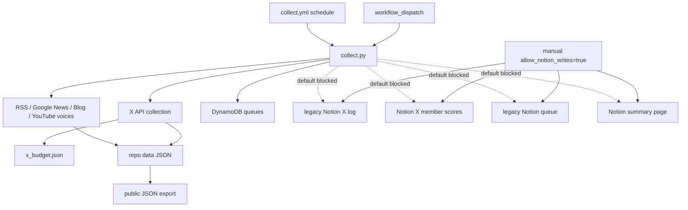

# X / RSS Collection Operations

Updated: 2026-06-26 JST  
署名: おと（Codex）

## Position

`collect.yml` は日次の候補生成ジョブとして継続する。
ただし、日次収集がNotionを変更する経路はデフォルトで閉じる。

自動でよいもの:

- Google News RSS / blog RSS / YouTube・Ameba RSS の取得。
- X keyword / whitelist / event evidence の収集。ただし `x_queries.json` の予算上限内。
- `data/latest.json`, `data/voices.json`, X状態ファイル、公開JSONの更新。
- DynamoDB の裏取りキュー / イベント候補キューへの追加。

手動または明示入力が必要なもの:

- 旧Notion X収集ログDBへの追記。
- Notion Xメンバーリストへのスコア書き戻し。
- Notion裏取りキューへの追記または掃除ループ。
- Notionサマリーページ更新。
- 用語集Notion DBへの新規alias自動登録・初期投入。
- X social graph discovery と candidate post review。
- 承認済みX候補のNotion Xメンバーリスト登録。

## Flow



## Notion Write Gate

`collect.py` only writes to Notion when:

```text
COLLECT_ALLOW_NOTION_WRITES=true
```

`collect.yml` sets this to false by default.
The workflow exposes a manual `allow_notion_writes` input for exceptional legacy runs.

This gate does not block Notion reads. Current allowed reads are:

- Xメンバーリスト read: whitelist collection source.
- Glossary DB read: runtime matching support.

## X API Boundary

Scheduled X collection remains automatic because it is bounded by:

- `x_queries.json` daily and monthly budget caps.
- `data/x_budget.json` spend state.
- existing `seen` and state files.

Do not add another scheduled X collector.
Manual X workflows stay manual because they can explore wider graph/post surfaces and consume paid API quota faster.

Detailed policy for `discover_x_social_graph.yml` and
`review_x_candidate_posts.yml` is in
`docs/x-candidate-workflows-operations.md`.

## Oto Interpreted X News Layer

X/RSS収集は、投稿本文の固定キーワード検知ではなく、X由来ニュースをおとが読んで
イベント・曲・会場の新規情報として解釈する方向へ寄せる。

方針は `docs/rare-signal-discovery-design.md` を優先する。

- X投稿は発見源として扱う。
- X投稿本文の丸コピーを公開・配信の主価値にしない。
- 既存DBとの照合で、まず `x_news_digest_for_oto` を作る。
- おとが読んだ後の要約、既存DBとの照合、裏どり結果を主情報にする。
- 日付が未確定でも、イベント・曲・会場の新規性があるとおとが判断した候補は `rare_signal` として残す。
- Notionや公開JSONへは直接反映しない。レビュー後に通常のイベント候補、曲候補、会場候補、または証拠へ昇格する。

## Manual Review Boundary

`review_x_candidate_posts.yml` stays manual.
It only writes review data by default.

The normal review mode requires `confirm=REVIEW X CANDIDATES` because it uses
X API quota. `discover_x_social_graph.yml` requires
`confirm=DISCOVER X SOCIAL GRAPH` for the same reason.

Notion member registration requires:

1. candidate review result has a promote recommendation,
2. Uchida-san marks the row as approved,
3. manual `sync_only=true` workflow run with
   `confirm=SYNC APPROVED X MEMBERS`.

## Operational Rule

If a future change wants scheduled collection to write to Notion, it must:

- explain which Notion DB/page is still an intentional operational surface,
- require an explicit workflow input or environment flag,
- add a test showing the scheduled default remains non-writing.
