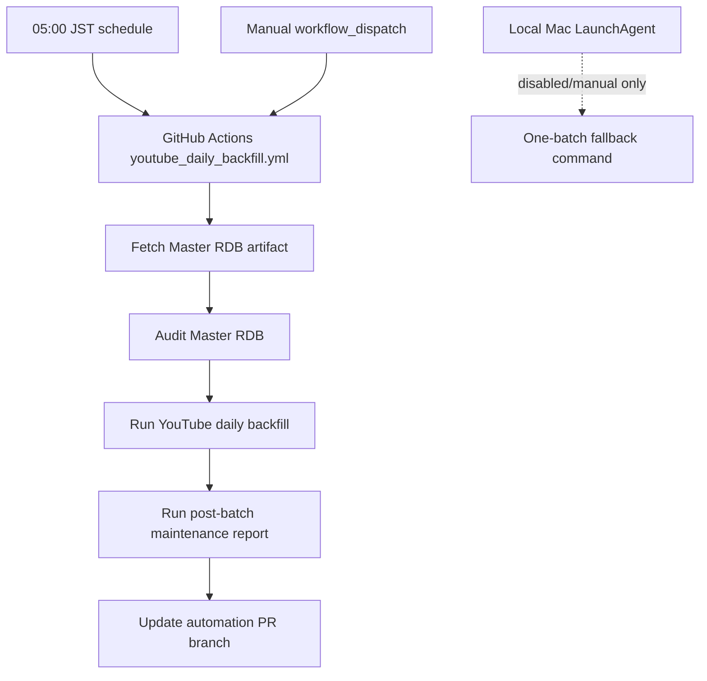

# YouTube Daily Operations

## Decision

GitHub Actions is the only automatic scheduler for the daily YouTube backfill.

The local macOS LaunchAgent is a manual fallback template. It must not run every
day in parallel with GitHub Actions.

## Why

The previous local setup had the same job shape as
`.github/workflows/youtube_daily_backfill.yml` and was scheduled for 05:00 JST.
That creates two operational problems:

- YouTube API quota can be consumed twice for the same daily collection window.
- The local run depends on the Mac worktree state. If the worktree is dirty or
  the Master RDB migration freeze blocks commit/push, unattended runs can fail
  before leaving a useful result.

## Current Owner



## Normal Run

Use the GitHub Actions workflow:

- Workflow: `youtube-daily-backfill`
- Schedule: 05:00 JST
- Manual trigger: `workflow_dispatch`
- Inputs:
  - `dry_run=true`: confirm the next selected rows without using the YouTube API.
  - `max_batches=N`: cap the number of batches during a manual run.

## Local Manual Fallback

Use this only when GitHub Actions is unavailable or a local investigation is
needed.

First inspect the selected row without using YouTube API quota:

```bash
python3 run_daily_youtube_backfill.py \
  --target-year 2026 \
  --month 6 \
  --auto-next-month \
  --focus-month 6 \
  --focus-month 7 \
  --limit 1 \
  --max-results 5 \
  --retry-selected \
  --until-quota-limited \
  --max-batches 1 \
  --mail-reminder \
  --dry-run
```

If the dry-run looks correct, run one real batch:

```bash
python3 run_daily_youtube_backfill.py \
  --target-year 2026 \
  --month 6 \
  --auto-next-month \
  --focus-month 6 \
  --focus-month 7 \
  --limit 1 \
  --max-results 5 \
  --retry-selected \
  --until-quota-limited \
  --max-batches 1 \
  --mail-reminder
```

Then regenerate the local read-only maintenance report:

```bash
python3 run_post_batch_maintenance.py
```

Do not pass `--commit` or `--push` from a local fallback run during the Master
RDB migration freeze. Commit and PR creation belong to GitHub Actions unless an
explicit recovery decision says otherwise.

## LaunchAgent State

The installed local plist was moved out of the active LaunchAgents path:

```text
~/Library/LaunchAgents/com.ryotauchida.bon-odori.youtube-daily.plist.disabled
```

The repo template remains at:

```text
ops/com.ryotauchida.bon-odori.youtube-daily.plist
```

That template intentionally has no `StartCalendarInterval`. If it is copied to
`~/Library/LaunchAgents`, it is still a manual fallback and not a daily
scheduler.

To confirm the local job is not loaded:

```bash
launchctl list com.ryotauchida.bon-odori.youtube-daily
```

Exit code `1` with no output means launchd does not have the job loaded.
